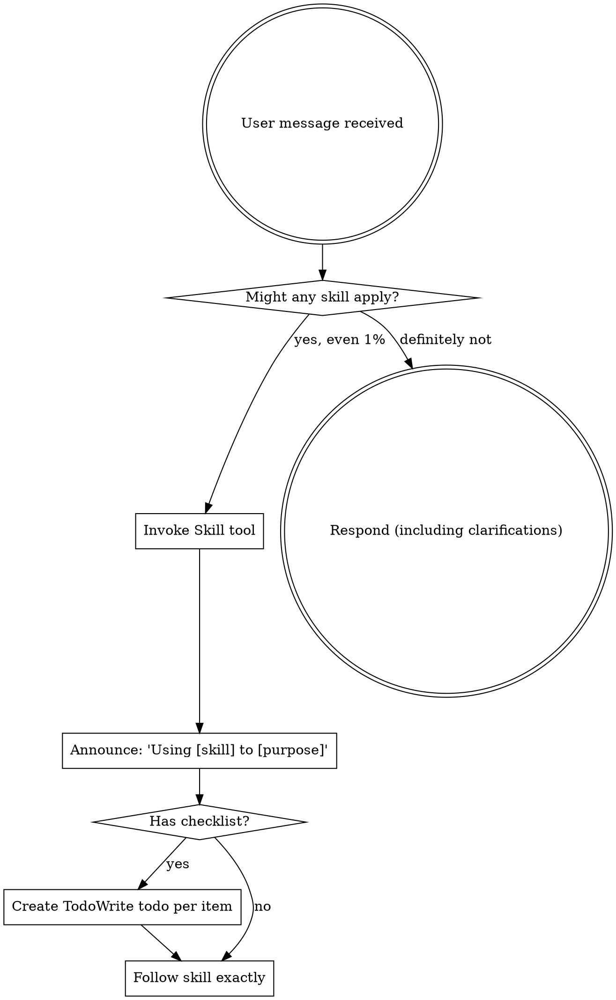

# CLAUDE.md - Agent Onboarding

<EXTREMELY-IMPORTANT>
If you think there is even a 1% chance a skill might apply to what you are doing, you ABSOLUTELY
MUST invoke the skill.

IF A SKILL APPLIES TO YOUR TASK, YOU DO NOT HAVE A CHOICE. YOU MUST USE IT.

This is not negotiable. This is not optional. You cannot rationalize your way out of this.
</EXTREMELY-IMPORTANT>

## Session Initialization (MANDATORY)

**Execute these steps at the START of EVERY session, including continuations:**

### Step 1: Acknowledge Onboarding

Read and acknowledge the repository guidelines:

```text
I have read and understood README.md and AGENTS.md for development-skills.
```

**You MUST state this acknowledgement before ANY other action.**

### Step 2: Load Skills-First Workflow

```text
Loading development-skills:skills-first-workflow
```

This skill enforces:

- Superpowers installed and bootstrapped
- `superpowers:using-superpowers` loaded
- AGENTS.md verified
- Process skills loaded before implementation

### Step 3: Verify Persona Configuration

Before any work that will result in commits or PRs, verify persona is configured.
See `CLAUDE.local.md` for machine-specific persona commands.

> **Loading Order**: This file (CLAUDE.md) → Read docs → State acknowledgement →
> Load skills-first-workflow → Verify persona → Begin work

---

## Critical Standards (Non-Negotiable)

Full details in AGENTS.md.

### TDD/BDD is Mandatory

**For ALL changes (code, config, documentation):**

1. **RED Phase**: Write failing test/checklist BEFORE any implementation
2. **Verify RED**: Confirm the test/checklist fails
3. **GREEN Phase**: Implement minimum to pass
4. **Verify GREEN**: Confirm passing
5. **Evidence**: Commit with SHA references

**Documentation changes use BDD checklists as tests:**

```markdown
## BDD Checklist: [Feature/Change Name]

### Acceptance Criteria

- [ ] Criterion 1 - [specific, verifiable outcome]
- [ ] Criterion 2 - [specific, verifiable outcome]

### Verification Status

- RED Phase: Checklist created, all items unchecked
- GREEN Phase: All items checked with evidence
```

### Issue-Driven Workflow

**No changes without a GitHub issue:**

1. Create or reference issue BEFORE starting work
2. All work must be done on a feature branch (leverage git worktrees)
3. Reference issue in all commits (`Refs: #123`)
4. Post evidence to issue comments
5. Close issue only after ALL scope delivered

**Additional rules:**

- Never commit directly to `main` - use feature branches
- Baseline failure blocks work: create blocking issue and pause until baseline passes
- Use `.worktrees/` as the preferred worktree directory

### Skills-First Execution

- Load `development-skills:skills-first-workflow` before any task
- Check for applicable skills BEFORE implementation
- Process skills (TDD, debugging) take priority over implementation skills

### Clean Build Principle

- Zero tolerance for warnings or errors
- All linting must pass before committing
- Run: `npm run lint` to verify

### Verification Before Completion

**NEVER claim completion without running verification:**

```text
BEFORE claiming any status:
1. IDENTIFY: What command proves this claim?
2. RUN: Execute the command (fresh, complete)
3. READ: Full output, check exit code
4. VERIFY: Does output confirm the claim?
5. ONLY THEN: Make the claim with evidence
```

---

## Skill Priority Model

When skills conflict, higher priority wins:

| Priority | Category                 | Examples                             |
| -------- | ------------------------ | ------------------------------------ |
| P0       | Safety & Integrity       | Security, traceability, issue-driven |
| P1       | Quality & Correctness    | Clean builds, test validity          |
| P2       | Consistency & Governance | Conventions, versioning              |
| P3       | Delivery & Flow          | Incremental execution, DX            |

### Verification Requirements

- **Concrete changes** (code/config): Provide applied evidence (commit SHAs, file links)
- **Process-only changes**: Provide analytical evidence (issue comment links)
- Never claim "complete" without running verification commands first

### Evidence Requirements Summary

| Change Type   | Evidence Required                                      |
| ------------- | ------------------------------------------------------ |
| Code changes  | Failing test commit SHA → Passing test commit SHA      |
| Documentation | BDD checklist (RED) → BDD checklist (GREEN) with links |
| Configuration | Before/after verification commands with output         |
| Process-only  | Issue comment links, decision records                  |

### Documentation Standards

- Use human-readable terminology in `/docs`, not skill names
- Check `docs/exclusions.md` before suggesting patterns
- Use ADRs for major architectural decisions

---

## Using Skills

### The Rule

**Invoke relevant or requested skills BEFORE any response or action.** Even a 1% chance a skill
might apply means you should invoke the skill to check. If an invoked skill turns out to be wrong
for the situation, you don't need to use it.



### Skill Rationalizations (Red Flags)

These thoughts mean STOP—you're rationalizing:

| Thought                             | Reality                                                |
| ----------------------------------- | ------------------------------------------------------ |
| "This is just a simple question"    | Questions are tasks. Check for skills.                 |
| "I need more context first"         | Skill check comes BEFORE clarifying questions.         |
| "Let me explore the codebase first" | Skills tell you HOW to explore. Check first.           |
| "I can check git/files quickly"     | Files lack conversation context. Check for skills.     |
| "Let me gather information first"   | Skills tell you HOW to gather information.             |
| "This doesn't need a formal skill"  | If a skill exists, use it.                             |
| "I remember this skill"             | Skills evolve. Read current version.                   |
| "This doesn't count as a task"      | Action = task. Check for skills.                       |
| "The skill is overkill"             | Simple things become complex. Use it.                  |
| "I'll just do this one thing first" | Check BEFORE doing anything.                           |
| "This feels productive"             | Undisciplined action wastes time. Skills prevent this. |
| "I know what that means"            | Knowing the concept ≠ using the skill. Invoke it.      |

### Skill Priority

When multiple skills could apply, use this order:

1. **Process skills first** (brainstorming, debugging) - these determine HOW to approach the task
2. **Implementation skills second** (frontend-design, mcp-builder) - these guide execution

"Let's build X" → brainstorming first, then implementation skills.
"Fix this bug" → debugging first, then domain-specific skills.

### Skill Types

**Rigid** (TDD, debugging): Follow exactly. Don't adapt away discipline.

**Flexible** (patterns): Adapt principles to context.

The skill itself tells you which.

### User Instructions

Instructions say WHAT, not HOW. "Add X" or "Fix Y" doesn't mean skip workflows.

---

## Persona-Switching for PR Workflow

### Two-Account Review Pattern

This repo requires different accounts for PR creation and approval:

| Phase          | Persona          | Profile     | Operations                     |
| -------------- | ---------------- | ----------- | ------------------------------ |
| Implementation | backend-engineer | contributor | Create branches, push, open PR |
| Review/Merge   | tech-lead        | maintainer  | Review, approve, merge         |

This two-account workflow ensures:

- Contributors cannot approve their own PRs
- Review accountability is maintained
- Auto-merge works correctly after approval

**Anti-pattern:** Reviewing as the same account that created the PR will fail with
"Cannot approve your own pull request".

### PR Creation Workflow

```bash
# 1. Switch to contributor persona for implementation
use_persona backend-engineer
gh auth status  # Verify: contributor account

# 2. Implement changes (following TDD)
# ... make changes ...

# 3. Commit with issue reference
git add -A && git commit -m "feat: description

Refs: #123"

# 4. Push and create PR
git push -u origin feature/branch-name
gh pr create --title "feat: description" --body "$(cat <<'EOF'
## Summary

- [What changed and why]

## Issues

- Refs: #123
- Closes #123

## Test Plan

- [ ] `npm run lint` - All checks pass
- [ ] BDD checklist verified

## Verification

- [Link to evidence]

## Auto-merge

- [ ] Enable auto-merge after required approvals and checks pass
EOF
)"
```

### PR Review and Merge Workflow

```bash
# 5. Switch to maintainer persona for review
use_persona tech-lead
gh auth status  # Verify: maintainer account

# 6. Review the PR
gh pr view <number>
gh pr diff <number>

# 7. If changes needed, switch back to contributor
use_persona backend-engineer
# ... make changes, push ...
use_persona tech-lead

# 8. Approve and merge
gh pr review <number> --approve --body "LGTM - [brief justification]"
gh pr merge <number> --squash --delete-branch --auto

# 9. Switch back to contributor for next work
use_persona backend-engineer
```

### Auto-Merge Configuration

After PR passes all checks and has required approvals:

```bash
# Enable auto-merge (squash strategy)
gh pr merge <number> --squash --delete-branch --auto
```

The `--auto` flag enables auto-merge when:

- All required status checks pass
- Required number of approvals received
- No merge conflicts

---

## Persona-Based Task Delegation

### Available Personas

Specialized expert personas are defined in `docs/roles/*.md`:

| Category         | Personas                                                            |
| ---------------- | ------------------------------------------------------------------- |
| Development      | Tech Lead, Senior Developer, QA Engineer                            |
| Security         | Security Reviewer, Security Architect                               |
| Performance      | Performance Engineer                                                |
| Infrastructure   | DevOps Engineer, Cloud Architect                                    |
| Product & Design | Product Owner, UX Expert, Accessibility Expert                      |
| Documentation    | Documentation Specialist, Technical Architect, Agent Skill Engineer |

Use canonical names from `docs/roles/README.md` when referencing personas.

### Delegation Rules

1. **Use subagents for specialized tasks** - Delegate to the most appropriate persona
   to reduce context pollution in the main conversation
2. **Select the right model** for the task (Claude model tiers):
   - `opus` - Complex architectural decisions, security reviews, nuanced analysis
   - `sonnet` - General development, code review, implementation
   - `haiku` - Quick lookups, simple validations, formatting tasks
3. **Codex available locally** - If installed, use for parallel tasks or local execution
4. **Load the persona** - Read the relevant `docs/roles/<persona>.md` before executing

### Mandatory Retrospective

After EVERY persona-delegated task completes:

1. **Conduct retrospective review** covering:
   - Process compliance (Did the persona follow TDD, issue-driven workflow, skills-first?)
   - Quality of result (Does output meet the persona's standards?)
   - Identified issues or improvements

2. **Present summary to user**:
   - Task completed and outcome
   - Retrospective findings (compliance, quality, issues)

3. **If meaningful issues found** (any Critical, 2+ Important, or patterns worth capturing):
   - Write retrospective to `docs/retrospectives/YYYY-MM-DD-<topic>.md`
   - Create GitHub issues for corrective actions
   - Reference retrospective in issue description

### Retrospective Template

```markdown
# Retrospective: [Task Description]

**Date**: YYYY-MM-DD
**Persona**: [Role name]
**Task**: [Brief description]

## Process Compliance

- [ ] TDD followed
- [ ] Issue referenced
- [ ] Skills-first observed
- [ ] Clean build maintained

## Quality Assessment

[Assessment of output quality against persona standards]

## Issues Identified

[List any problems, with severity]

## Corrective Actions

- [ ] Issue #XX: [Description]
```

---

## Session Continuation Protocol

**When continuing from a previous session:**

1. **DO NOT** rely solely on the session summary
2. **DO** execute full Session Initialization steps above
3. **DO** read relevant issues before implementing
4. **DO** verify acceptance criteria from issues
5. **DO** apply TDD/BDD before any file changes

---

## Red Flags - STOP Immediately

If you find yourself thinking:

- "I'll just continue from the summary" → STOP, do full initialization
- "This is simple, skip TDD" → STOP, TDD applies to ALL changes
- "I'll verify after" → STOP, verification is BEFORE
- "No issue needed for this" → STOP, create issue first
- "I remember the requirements" → STOP, read the actual issue
- "Skip persona switch, it's quick" → STOP, always use correct persona

---

## Compliance Checklists

### Before ANY Implementation Work

- [ ] Session initialization completed (acknowledgement stated)
- [ ] skills-first-workflow loaded
- [ ] Persona verified (correct account for task type)
- [ ] Issue exists and is referenced
- [ ] TDD/BDD approach planned (test/checklist first)

### Before ANY PR

- [ ] All commits reference issue
- [ ] Tests/checklists pass
- [ ] `npm run lint` passes
- [ ] Contributor persona used for PR creation
- [ ] PR body follows template

### Before ANY Merge

- [ ] Switched to maintainer persona
- [ ] PR reviewed and approved
- [ ] Auto-merge enabled with squash strategy
- [ ] Switched back to contributor after merge

---

## Bootstrap Requirements

See AGENTS.md "Bootstrap (First-Time Setup)" for detailed instructions on installing
Superpowers and configuring this skill library.

## Quick Reference

| Resource                        | Purpose                                       |
| ------------------------------- | --------------------------------------------- |
| `README.md`                     | Repository standards, skill list, format spec |
| `AGENTS.md`                     | Complete agent execution rules                |
| `CONTRIBUTING.md`               | Contribution process                          |
| `CLAUDE.local.md`               | Machine-specific persona configuration        |
| `docs/roles/*.md`               | Expert persona definitions                    |
| `docs/architecture-overview.md` | Architectural patterns                        |
| `docs/coding-standards.md`      | Code and doc standards                        |
| `docs/testing-strategy.md`      | BDD/TDD methodology                           |
| `docs/exclusions.md`            | Patterns explicitly declined                  |
| `docs/retrospectives/`          | Task retrospective records                    |

## Quality Commands

```bash
npm run lint          # Run all linting
npm run lint:fix      # Auto-fix issues
```

---

_This file ensures agents are properly onboarded. For complete rules, always refer to AGENTS.md._
_For machine-specific configuration (persona paths, accounts), see CLAUDE.local.md._
