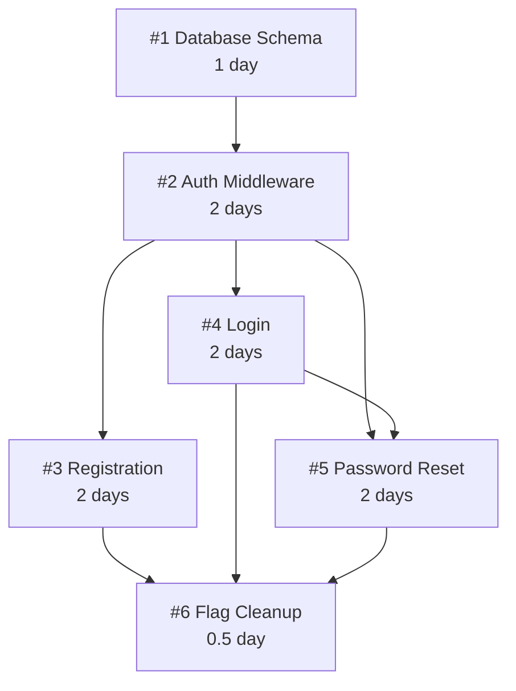

# Multi-Ticket Decomposition for Requirements-Gathering

**Ticket:** #72
**Date:** 2026-01-06
**Status:** Design Complete

## Overview

Enhance the requirements-gathering skill to automatically detect large work items and decompose
them into multiple related tickets for phased, incremental delivery.

The core principle remains unchanged: **gather requirements, create ticket(s), stop**. The
decomposition phase adds structure without changing the endpoint.

## Workflow

```text
┌─────────────────────────────────────────────────────────────────────┐
│                    ENHANCED WORKFLOW                                 │
├─────────────────────────────────────────────────────────────────────┤
│  1. Gather Requirements (unchanged)                                  │
│     └─→ Ask questions, structure Goal/Requirements/Acceptance/Context│
│                                                                      │
│  2. Scope Detection (NEW)                                           │
│     └─→ Load references/scope-detection.md                          │
│     └─→ Evaluate structural signals + adaptive thresholds           │
│     └─→ If signals suggest decomposition → proceed to step 3        │
│     └─→ If single ticket appropriate → skip to step 5               │
│                                                                      │
│  3. Decomposition Proposal (NEW)                                    │
│     └─→ Present: outline + table + ASCII graph                      │
│     └─→ User edits (merge, split, reorder, modify)                  │
│     └─→ Final review before confirmation                            │
│                                                                      │
│  4. Platform Organization (NEW - once per repo)                     │
│     └─→ Check for existing ADR                                      │
│     └─→ If none: offer platform options, create ADR via PR          │
│     └─→ Apply stored decisions                                      │
│                                                                      │
│  5. Create Tickets                                                  │
│     └─→ Single ticket OR epic + child tickets + cleanup ticket      │
│     └─→ Apply dependency links (platform-native)                    │
│     └─→ Embed Mermaid graph in epic description                     │
│                                                                      │
│  6. Stop                                                            │
│     └─→ Provide URLs, stop (no design, no plan, no commits)         │
└─────────────────────────────────────────────────────────────────────┘
```

## Scope Detection

Detection lives in `references/scope-detection.md` and combines **structural signals** (primary)
with **adaptive thresholds** (backstop).

### Structural Signals

| Signal                       | Indicator                              | Example                                                    |
| ---------------------------- | -------------------------------------- | ---------------------------------------------------------- |
| Multiple user flows          | Distinct end-to-end scenarios          | "User registration AND password reset AND profile editing" |
| Multiple API endpoints       | Separate HTTP operations               | "GET /users, POST /orders, PUT /inventory"                 |
| Multiple database entities   | New tables or major schema changes     | "Users table, Orders table, Audit log table"               |
| Cross-cutting concerns       | Auth, logging, caching, error handling | "Add authentication to all endpoints"                      |
| Multiple consumers           | Different UI components or services    | "Web dashboard AND mobile app AND admin panel"             |
| Infrastructure + application | Deployment alongside features          | "Set up Redis AND implement caching layer"                 |

### Adaptive Thresholds

Stored in ADR after first run. Calculated from team context:

```text
Sprint duration: [X days]
Ideal ticket size: 3 days (configurable)
Max requirements per ticket: sprint_days / 3 (rounded)
Max acceptance criteria: 2x requirements threshold
```

### Detection Output

When signals are detected, the skill presents findings:

```text
I've identified signals suggesting this work could be decomposed:
- 3 distinct user flows detected (registration, login, password reset)
- 2 database tables (Users, Sessions)
- Cross-cutting concern: authentication middleware

Based on your team's 2-week sprints, tickets targeting 3-day delivery
would suggest splitting this into 3-4 tickets.

Would you like me to propose a decomposition?
```

User always decides whether to proceed with decomposition.

## Decomposition Proposal Format

The proposal includes three views for complete visibility.

### Outline View

```text
Epic: Implement User Authentication System
├── #1 Database Schema & Models [Foundation]
│   └── Users and Sessions tables, entity models
├── #2 Authentication Middleware [Foundation]
│   └── JWT validation, request context, cross-cutting auth logic
│   └── blocked by: #1
├── #3 User Registration Flow [Feature]
│   └── POST /register, email validation, password hashing
│   └── blocked by: #1, #2
├── #4 User Login Flow [Feature]
│   └── POST /login, session creation, token generation
│   └── blocked by: #1, #2
├── #5 Password Reset Flow [Feature]
│   └── POST /forgot-password, reset token, POST /reset-password
│   └── blocked by: #1, #2, #4
└── #6 Remove Feature Flags [Cleanup]
    └── Remove auth feature flags, verify all flows enabled
    └── blocked by: #3, #4, #5
```

### Details Table

| #   | Title                     | Description                                                                 | Blocked By | Size    | Safe to Ship           |
| --- | ------------------------- | --------------------------------------------------------------------------- | ---------- | ------- | ---------------------- |
| 1   | Database Schema & Models  | Create Users and Sessions tables with migrations, entity models             | —          | 1 day   | Yes (no consumers yet) |
| 2   | Authentication Middleware | JWT validation, auth context injection, protect routes                      | #1         | 2 days  | Yes (behind flag)      |
| 3   | User Registration Flow    | Registration endpoint, email validation, password hashing, welcome email    | #1, #2     | 2 days  | Flag until #4 ready    |
| 4   | User Login Flow           | Login endpoint, credential validation, JWT generation, session tracking     | #1, #2     | 2 days  | Flag until #3 ready    |
| 5   | Password Reset Flow       | Forgot password, reset token generation, reset endpoint, email notification | #1, #2, #4 | 2 days  | Yes (requires login)   |
| 6   | Remove Feature Flags      | Remove all auth feature flags, verify flows work without flags              | #3, #4, #5 | 0.5 day | Yes (final cleanup)    |

### Dependency Graph (ASCII for Terminal)

```text
                    ┌─────────────────────┐
                    │  #1 Database Schema │
                    │     [1 day]         │
                    └──────────┬──────────┘
                               │
                               ▼
                    ┌─────────────────────┐
                    │ #2 Auth Middleware  │
                    │     [2 days]        │
                    └──────────┬──────────┘
                               │
              ┌────────────────┼────────────────┐
              │                │                │
              ▼                ▼                │
   ┌──────────────────┐ ┌──────────────────┐   │
   │ #3 Registration  │ │   #4 Login       │   │
   │    [2 days]      │ │   [2 days]       │   │
   └────────┬─────────┘ └────────┬─────────┘   │
            │                    │             │
            │                    ▼             │
            │         ┌──────────────────┐     │
            │         │ #5 Password Reset│◄────┘
            │         │    [2 days]      │
            │         └────────┬─────────┘
            │                  │
            └───────┬──────────┘
                    ▼
         ┌─────────────────────┐
         │ #6 Feature Flag     │
         │   Cleanup [0.5 day] │
         └─────────────────────┘

Critical Path: #1 → #2 → #4 → #5 → #6 (7.5 days)
Parallel Work: #3 and #4 can run in parallel after #2
```

### Dependency Graph (Mermaid for Epic Description)



## User Editing

Users can modify the decomposition before approval:

- **Merge tickets** - "combine #3 and #4"
- **Split tickets** - "split #2 into JWT validation and middleware"
- **Reorder dependencies** - "make #5 depend only on #1"
- **Modify details** - Change titles, descriptions, acceptance criteria
- **Add/remove tickets** - Insert new tickets or remove unnecessary ones

After edits, the skill shows the complete updated breakdown for final review before any tickets are created.

## Platform Organization

### First-Run Options (GitHub Example)

```text
No existing ADR found for ticket organization.

Your repository uses GitHub. Here are your options:

┌─────────────────────────────────────────────────────────────────┐
│ Option A: GitHub Projects (Recommended)                         │
├─────────────────────────────────────────────────────────────────┤
│ - Epic = Project board with linked issues                       │
│ - Dependencies = "blocked by #X" in issue body + task lists     │
│ - Grouping = Project columns or custom fields                   │
│ - Limitation: No native blocker enforcement                     │
└─────────────────────────────────────────────────────────────────┘

┌─────────────────────────────────────────────────────────────────┐
│ Option B: Labels + Milestones                                   │
├─────────────────────────────────────────────────────────────────┤
│ - Epic = Milestone grouping issues                              │
│ - Dependencies = "blocked by #X" in issue body                  │
│ - Grouping = Labels (e.g., "epic:auth-system")                  │
│ - Limitation: Less visual than Projects                         │
└─────────────────────────────────────────────────────────────────┘

┌─────────────────────────────────────────────────────────────────┐
│ Option C: Tracking Issue                                        │
├─────────────────────────────────────────────────────────────────┤
│ - Epic = Parent issue with task list checkboxes                 │
│ - Dependencies = Checkbox order + "blocked by" references       │
│ - Grouping = All child issues linked in parent body             │
│ - Limitation: Manual checkbox maintenance                       │
└─────────────────────────────────────────────────────────────────┘

Which option works best for your team?
```

### ADR Creation

After selection:

1. Create temporary branch
2. Delegate to ADR skill to write `docs/adr/NNNN-ticket-organization.md`
3. Open PR for review
4. Proceed with ticket creation using selected approach

### Subsequent Runs

```text
Found existing ADR: docs/adr/0003-ticket-organization.md
Using: GitHub Projects with "blocked by" references
```

No re-prompting. Decision is reused until ADR is superseded.

## Feature Flag Tracking

### Epic Description Section

```markdown
## Feature Flags

| Flag                        | Introduced In | Purpose                             | Status |
| --------------------------- | ------------- | ----------------------------------- | ------ |
| `AUTH_REGISTRATION_ENABLED` | #3            | Hide registration until login ready | Active |
| `AUTH_MIDDLEWARE_ENABLED`   | #2            | Gradual rollout of auth checks      | Active |

**Cleanup ticket:** #6
```

### Cleanup Ticket Content

```markdown
## Goal

Remove all feature flags introduced during the Auth System epic to complete the rollout.

## Requirements

1. Remove all feature flags from codebase
2. Verify all features work without flags
3. Update any documentation referencing flags

## Acceptance Criteria

- [ ] `AUTH_REGISTRATION_ENABLED` removed from:
  - [ ] Config files
  - [ ] Registration controller
  - [ ] UI components
  - [ ] Tests updated
- [ ] `AUTH_MIDDLEWARE_ENABLED` removed from:
  - [ ] Config files
  - [ ] Middleware initialization
  - [ ] Route guards
  - [ ] Tests updated
- [ ] No feature flag references remain in codebase (grep verification)
- [ ] All auth flows tested in production without flags

## Context

This ticket blocks epic completion. Feature flags were introduced to enable
safe incremental delivery. Now that all components are deployed and verified,
flags must be removed to reduce code complexity and configuration overhead.
```

### Epic Completion Gate

Epic acceptance criteria includes:

```markdown
- [ ] All feature flags removed (see #6)
```

## File Structure

```text
skills/requirements-gathering/
├── SKILL.md                              # Modified - add decomposition workflow
├── requirements-gathering.test.md        # Modified - add decomposition tests
├── references/
│   ├── examples.md                       # Existing
│   ├── platform-cli-examples.md          # Modified - add epic/dependency commands
│   ├── scope-detection.md                # NEW - structural signals & thresholds
│   ├── decomposition-formats.md          # NEW - outline/table/graph templates
│   └── platform-organization-options.md  # NEW - GitHub/Azure DevOps/Jira options
```

## Edge Cases & Error Handling

| Scenario                                       | Handling                                                              |
| ---------------------------------------------- | --------------------------------------------------------------------- |
| User declines decomposition                    | Proceed with single ticket creation (current behavior)                |
| Platform CLI not authenticated                 | Detect early, provide auth instructions, stop before decomposition    |
| ADR skill not available                        | Fall back to inline ADR template, create manually with guidance       |
| Epic creation fails mid-way                    | Roll back created tickets, report which succeeded/failed, offer retry |
| No structural signals detected                 | Skip decomposition, create single ticket (no change to current flow)  |
| User removes all but one ticket during editing | Convert to single ticket flow, skip epic creation                     |
| Platform doesn't support dependencies          | Document in ADR, use description references only, note limitation     |

### Validation Before Creation

```text
Pre-creation checklist:
- All tickets have titles
- All tickets have at least one acceptance criterion
- Dependency graph has no cycles
- At least one ticket has no blockers (can start immediately)
- Cleanup ticket exists if feature flags mentioned
- Platform CLI authenticated
- ADR decision captured (or user opted for single-run choice)
```

### Cycle Detection

```text
Dependency cycle detected:
   #2 blocked by #4 → #4 blocked by #3 → #3 blocked by #2

Please adjust dependencies. At least one ticket must be unblocked
to start work.
```

### Partial Failure Recovery

```text
Ticket creation partially failed:

Created successfully:
  - Epic #100: User Authentication System
  - #101: Database Schema & Models
  - #102: Authentication Middleware

Failed:
  - #103: User Registration Flow - API rate limit exceeded

Options:
  1. Retry failed tickets
  2. Keep created tickets, create remaining manually
  3. Delete all created tickets and start over
```

## Testing

### BDD Scenarios

```gherkin
Feature: Multi-ticket decomposition

  Scenario: Detect structural signals suggesting decomposition
    Given requirements with multiple user flows
    And requirements mention 3 API endpoints
    And requirements include 2 database tables
    When scope detection runs
    Then agent identifies decomposition signals
    And agent asks user if decomposition is desired

  Scenario: User approves proposed decomposition
    Given a decomposition proposal with 4 tickets
    When user says "looks good"
    Then agent shows final review
    And agent waits for confirmation before creating tickets

  Scenario: User edits decomposition before approval
    Given a decomposition proposal with 4 tickets
    When user says "merge tickets 2 and 3"
    Then agent updates proposal combining those tickets
    And agent shows revised outline, table, and graph
    And agent asks for further changes or confirmation

  Scenario: Dependency cycle rejected
    Given a decomposition proposal
    When user edits create a cycle (#1 → #2 → #3 → #1)
    Then agent warns about the cycle
    And agent does not proceed until cycle resolved

  Scenario: Platform ADR already exists
    Given docs/adr/0003-ticket-organization.md exists
    When decomposition is approved
    Then agent uses stored platform decisions
    And agent does not prompt for platform options

  Scenario: First-time platform decision
    Given no ticket organization ADR exists
    When decomposition is approved
    Then agent presents platform-specific options
    And agent creates ADR via PR after selection
    And agent proceeds with ticket creation

  Scenario: Single ticket when no signals detected
    Given requirements for a small feature
    And no structural signals detected
    When requirements gathering completes
    Then agent creates single ticket (current behavior)
    And agent does not propose decomposition

  Scenario: Feature flag cleanup ticket auto-created
    Given decomposition includes feature flags
    When tickets are created
    Then cleanup ticket is created as final child
    And epic includes "All feature flags removed" criterion
    And cleanup ticket lists all flags with removal checklist

  Scenario: Partial creation failure recovery
    Given decomposition with 5 tickets approved
    When ticket 3 creation fails
    Then agent reports which tickets succeeded
    And agent offers retry, continue, or rollback options
```

### Coverage Goals

- All structural signals detected individually
- Threshold calculations from team context
- All edit operations (merge, split, reorder, modify)
- All three platforms (GitHub, Azure DevOps, Jira)
- ADR creation and reuse flows
- Error recovery paths
