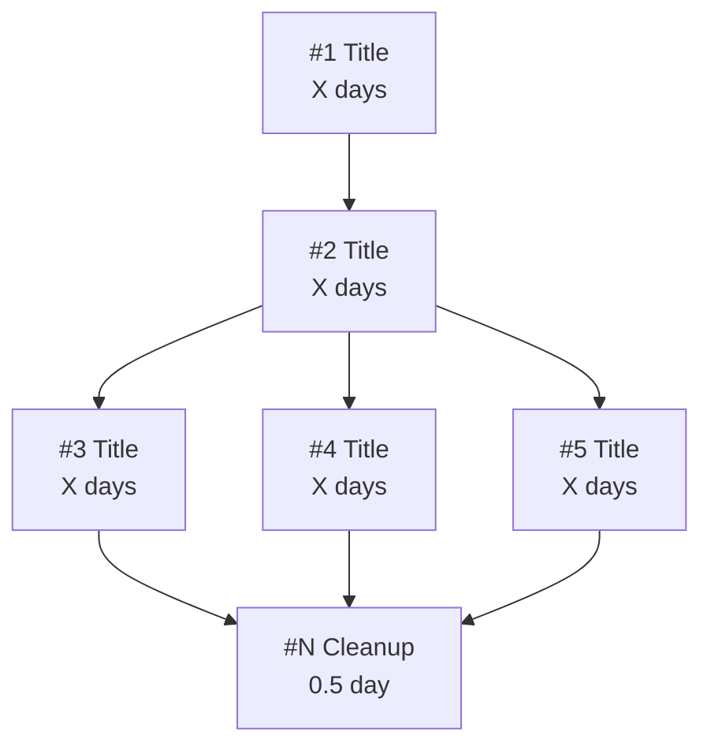
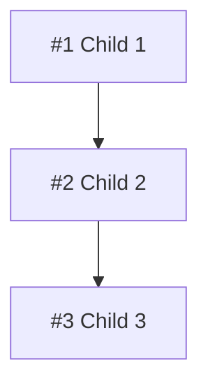
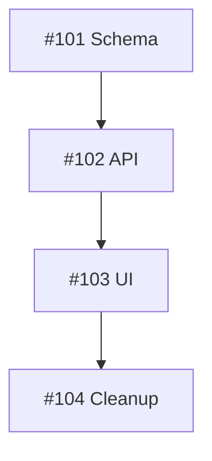

# Multi-Ticket Decomposition Implementation Plan

> **For Claude:** REQUIRED SUB-SKILL: Use superpowers:executing-plans to implement this plan task-by-task.

**Goal:** Enhance requirements-gathering skill to detect large work and decompose into epic + child tickets.

**Architecture:** Add scope detection after requirements structuring. If signals detected, propose decomposition
with user approval. Create epic + children using platform-adaptive organization stored in ADR.

**Tech Stack:** Markdown skill documentation, BDD tests, GitHub/Azure DevOps/Jira CLI commands

---

## Task 1: Add BDD Test Scenarios for Decomposition

**Files:**

- Modify: `skills/requirements-gathering/requirements-gathering.test.md`

### Step 1: Add decomposition test section to test file

Add after line 215 (before end of file):

```markdown
## Decomposition Scenarios

### DECOMPOSITION-1: Detect Structural Signals

**Given**: Requirements mention multiple user flows AND multiple API endpoints
**When**: Agent completes requirements structuring
**Then**: [ ] Agent identifies decomposition signals
**And**: [ ] Agent presents signal findings to user
**And**: [ ] Agent asks if user wants decomposition proposal
**Result**: ✅ PASS - Automatic signal detection works

**Signals to detect**:

- [ ] Multiple user flows (distinct end-to-end scenarios)
- [ ] Multiple API endpoints (separate HTTP operations)
- [ ] Multiple database entities (new tables or schema changes)
- [ ] Cross-cutting concerns (auth, logging, caching)
- [ ] Multiple consumers (different UI/services)
- [ ] Infrastructure + application (deployment + features)

### DECOMPOSITION-2: User Approves Decomposition Proposal

**Given**: Agent has detected decomposition signals
**When**: User says "yes" to decomposition proposal
**Then**: [ ] Agent presents outline view (hierarchical tickets)
**And**: [ ] Agent presents details table (title, description, dependencies, size)
**And**: [ ] Agent presents dependency graph (ASCII format)
**And**: [ ] Agent asks for edits or confirmation
**Result**: ✅ PASS - Three-view proposal presented

### DECOMPOSITION-3: User Edits Decomposition

**Given**: Agent has presented decomposition proposal
**When**: User requests changes (merge, split, reorder)
**Then**: [ ] Agent applies requested changes
**And**: [ ] Agent shows updated proposal
**And**: [ ] Agent asks for further edits or confirmation
**Result**: ✅ PASS - Full editing capability works

**Edit operations to support**:

- [ ] Merge tickets ("combine #2 and #3")
- [ ] Split tickets ("split #1 into two")
- [ ] Reorder dependencies ("make #3 depend on #1 only")
- [ ] Modify details (titles, descriptions)
- [ ] Add/remove tickets

### DECOMPOSITION-4: Final Review Before Creation

**Given**: User confirms decomposition is correct
**When**: Agent prepares to create tickets
**Then**: [ ] Agent shows complete final breakdown
**And**: [ ] Agent asks for explicit confirmation
**And**: [ ] Agent does NOT create tickets until confirmed
**Result**: ✅ PASS - Final review gate enforced

### DECOMPOSITION-5: Platform ADR Check

**Given**: User confirms decomposition
**When**: Agent checks for platform organization ADR
**Then**: [ ] Agent checks `docs/adr/` for ticket-organization ADR
**And**: [ ] If found: Agent uses stored decisions
**And**: [ ] If not found: Agent presents platform options
**Result**: ✅ PASS - ADR-based decision reuse works

### DECOMPOSITION-6: Epic and Child Ticket Creation

**Given**: User has approved decomposition and platform choice
**When**: Agent creates tickets
**Then**: [ ] Agent creates epic/parent ticket first
**And**: [ ] Agent creates child tickets with dependencies
**And**: [ ] Agent creates cleanup ticket if feature flags needed
**And**: [ ] Agent embeds Mermaid graph in epic description
**And**: [ ] Agent provides all ticket URLs
**And**: [ ] Agent STOPS (no design, no plan, no commits)
**Result**: ✅ PASS - Multi-ticket creation works

### DECOMPOSITION-7: Single Ticket When No Signals

**Given**: Requirements for small/simple feature
**When**: Agent evaluates scope
**Then**: [ ] Agent detects no structural signals
**And**: [ ] Agent skips decomposition proposal
**And**: [ ] Agent creates single ticket (current behavior)
**Result**: ✅ PASS - Graceful fallback to simple flow

### DECOMPOSITION-8: Dependency Cycle Detection

**Given**: User edits create dependency cycle
**When**: Agent validates dependencies
**Then**: [ ] Agent detects the cycle
**And**: [ ] Agent warns user about cycle
**And**: [ ] Agent does NOT proceed until cycle resolved
**Result**: ✅ PASS - Cycle prevention works

### DECOMPOSITION-9: Feature Flag Tracking

**Given**: Decomposition includes tickets requiring feature flags
**When**: Agent creates tickets
**Then**: [ ] Epic includes Feature Flags section
**And**: [ ] Cleanup ticket created as final child
**And**: [ ] Cleanup ticket lists all flags with removal checklist
**And**: [ ] Epic acceptance criteria includes flag removal
**Result**: ✅ PASS - Feature flag tracking works

### DECOMPOSITION-10: User Declines Decomposition

**Given**: Agent has detected decomposition signals
**When**: User declines decomposition ("no, keep it as one ticket")
**Then**: [ ] Agent proceeds with single ticket creation
**And**: [ ] Agent does NOT force decomposition
**Result**: ✅ PASS - User choice respected
```

### Step 2: Verify test file is valid markdown

Run: `npx markdownlint-cli2 "skills/requirements-gathering/requirements-gathering.test.md"`
Expected: No errors for new content

### Step 3: Commit test scenarios

```bash
git add skills/requirements-gathering/requirements-gathering.test.md
git commit -m "test: add BDD scenarios for multi-ticket decomposition"
```

---

## Task 2: Create Scope Detection Reference

**Files:**

- Create: `skills/requirements-gathering/references/scope-detection.md`

### Step 1: Create scope detection reference document

````markdown
# Scope Detection

## Overview

Detect when work items are too large for single tickets and should be decomposed into multiple
related tickets for phased delivery.

Detection combines **structural signals** (primary) with **adaptive thresholds** (backstop).
User always makes final decision on whether to decompose.

## Structural Signals

Evaluate requirements for these signals during the structuring phase:

| Signal                       | How to Detect                                                                  | Weight |
| ---------------------------- | ------------------------------------------------------------------------------ | ------ |
| Multiple user flows          | Requirements describe 2+ distinct end-to-end scenarios                         | High   |
| Multiple API endpoints       | Requirements mention 2+ separate HTTP operations                               | High   |
| Multiple database entities   | Requirements include 2+ new tables or major schema changes                     | High   |
| Cross-cutting concerns       | Requirements mention auth, logging, caching, or error handling across features | Medium |
| Multiple consumers           | Requirements describe 2+ different UI components or services                   | Medium |
| Infrastructure + application | Requirements combine deployment/infra work with feature development            | Medium |

### Signal Detection Examples

**Multiple user flows:**

```text
Requirements mention: "user registration", "password reset", "profile editing"
→ 3 distinct user flows detected
```
````

**Multiple API endpoints:**

```text
Requirements mention: "GET /users", "POST /orders", "PUT /inventory"
→ 3 separate API endpoints detected
```

**Cross-cutting concerns:**

```text
Requirements mention: "add authentication to all endpoints"
→ Cross-cutting auth concern detected
```

## Adaptive Thresholds

Store team context in ADR for threshold calculation:

```text
Sprint duration: [X days] (default: 10)
Ideal ticket size: 3 days
Team velocity factor: 1.0 (adjust based on team)

Calculated thresholds:
- Max requirements per ticket: sprint_days / ideal_size = 10/3 ≈ 3
- Max acceptance criteria per ticket: 2 × max_requirements = 6
```

### First-Time Setup

If no ADR exists, ask user:

```text
I'd like to calibrate decomposition thresholds for your team.

What is your typical sprint duration?
1. 1 week (5 days)
2. 2 weeks (10 days)
3. 3 weeks (15 days)
4. 4 weeks (20 days)

What's your ideal ticket size for a skilled developer?
1. 1 day (very granular)
2. 2-3 days (recommended)
3. 4-5 days (larger chunks)
```

## Detection Output

When signals are detected, present findings:

```text
I've identified signals suggesting this work could be decomposed:

Structural signals detected:
- 3 distinct user flows (registration, login, password reset)
- 2 database tables (Users, Sessions)
- Cross-cutting concern: authentication middleware

Threshold analysis:
- 7 requirements (threshold: 3 per ticket)
- 12 acceptance criteria (threshold: 6 per ticket)

Based on your team's 2-week sprints with 3-day ideal tickets,
this suggests splitting into 3-4 tickets.

Would you like me to propose a decomposition?
```

## When NOT to Decompose

Skip decomposition if:

- No structural signals detected
- Requirements count ≤ threshold
- Acceptance criteria count ≤ threshold
- User explicitly declines

Proceed with single ticket in these cases.

## Integration with Workflow

```text
┌─────────────────────────────────────────┐
│  After structuring requirements:        │
│                                         │
│  1. Evaluate structural signals         │
│  2. Check against thresholds            │
│  3. If signals detected:                │
│     → Present findings                  │
│     → Ask user if decomposition wanted  │
│  4. If no signals or user declines:     │
│     → Proceed with single ticket        │
└─────────────────────────────────────────┘
```

### Step 2: Verify markdown lint passes

Run: `npx markdownlint-cli2 "skills/requirements-gathering/references/scope-detection.md"`
Expected: No errors

### Step 3: Commit scope detection reference

```bash
git add skills/requirements-gathering/references/scope-detection.md
git commit -m "docs: add scope detection reference for decomposition"
```

---

## Task 3: Create Decomposition Formats Reference

**Files:**

- Create: `skills/requirements-gathering/references/decomposition-formats.md`

### Step 1: Create decomposition formats reference document

````markdown
# Decomposition Formats

## Overview

When presenting decomposition proposals, use three complementary views to give users complete
visibility into the proposed ticket structure.

## Outline View

Hierarchical view showing ticket relationships:

```text
Epic: [Epic Title]
├── #1 [Ticket Title] [Category]
│   └── [Brief description]
│   └── blocked by: [dependencies]
├── #2 [Ticket Title] [Category]
│   └── [Brief description]
│   └── blocked by: #1
├── #3 [Ticket Title] [Category]
│   └── [Brief description]
│   └── blocked by: #1, #2
└── #N Remove Feature Flags [Cleanup]
    └── Remove all feature flags, verify flows
    └── blocked by: [all feature tickets]
```
````

### Category Labels

- `[Foundation]` - Infrastructure, schema, shared components
- `[Feature]` - User-facing functionality
- `[Integration]` - Connecting components together
- `[Cleanup]` - Technical debt, flag removal

## Details Table

Tabular view with full information:

```markdown
| #   | Title                | Description                         | Blocked By | Size    | Safe to Ship         |
| --- | -------------------- | ----------------------------------- | ---------- | ------- | -------------------- |
| 1   | [Title]              | [What this delivers]                | —          | X days  | Yes/No (reason)      |
| 2   | [Title]              | [What this delivers]                | #1         | X days  | Yes/Flag/No (reason) |
| ... | ...                  | ...                                 | ...        | ...     | ...                  |
| N   | Remove Feature Flags | Remove flags, verify all flows work | #X, #Y, #Z | 0.5 day | Yes (final cleanup)  |
```

### Safe to Ship Values

- `Yes` - Can deploy independently without user impact
- `Yes (reason)` - Safe with explanation (e.g., "no consumers yet")
- `Flag until #X` - Needs feature flag until dependency ready
- `No (reason)` - Cannot ship independently

### Size Guidelines

- Foundation/schema: 0.5-1 day
- Simple feature: 1-2 days
- Complex feature: 2-3 days
- Integration: 1-2 days
- Cleanup: 0.5 day

## Dependency Graph (ASCII)

Visual graph for terminal display:

```text
                    ┌─────────────────────┐
                    │  #1 [Title]         │
                    │     [X days]        │
                    └──────────┬──────────┘
                               │
                               ▼
                    ┌─────────────────────┐
                    │  #2 [Title]         │
                    │     [X days]        │
                    └──────────┬──────────┘
                               │
              ┌────────────────┼────────────────┐
              │                │                │
              ▼                ▼                ▼
   ┌──────────────────┐ ┌──────────────────┐ ┌──────────────────┐
   │  #3 [Title]      │ │  #4 [Title]      │ │  #5 [Title]      │
   │     [X days]     │ │     [X days]     │ │     [X days]     │
   └────────┬─────────┘ └────────┬─────────┘ └────────┬─────────┘
            │                    │                    │
            └───────────────┬────┴────────────────────┘
                            ▼
                 ┌─────────────────────┐
                 │  #N Cleanup         │
                 │     [0.5 day]       │
                 └─────────────────────┘

Critical Path: #1 → #2 → #X → #N (Y days)
Parallel Work: #3, #4, #5 can run in parallel after #2
```

## Dependency Graph (Mermaid)

For embedding in epic description (renders in GitHub/Azure DevOps):

````markdown

````

## Feature Flag Table

When decomposition requires feature flags:

```markdown
## Feature Flags

| Flag                | Introduced In | Purpose                     | Status |
| ------------------- | ------------- | --------------------------- | ------ |
| `FEATURE_X_ENABLED` | #3            | Hide feature until #4 ready | Active |
| `FEATURE_Y_ENABLED` | #4            | Gradual rollout             | Active |

**Cleanup ticket:** #N
```

## User Editing Instructions

After presenting proposal, offer editing:

```text
You can now:
- Merge tickets (e.g., "combine #3 and #4")
- Split tickets (e.g., "split #2 into two")
- Reorder dependencies (e.g., "make #5 depend on #1 only")
- Modify titles or descriptions
- Add or remove tickets

What changes would you like to make, or does this look good?
```

## Final Review Template

Before creating tickets, show final review:

```text
Final Review - Please Confirm

[Show complete outline view]
[Show complete details table]
[Show complete dependency graph]

This will create:
- 1 epic ticket
- N child tickets
- Dependencies linked via [platform method]
- Feature flags tracked in epic and cleanup ticket

Type "confirm" to create these tickets, or request changes.
```

### Step 2: Verify markdown lint passes

Run: `npx markdownlint-cli2 "skills/requirements-gathering/references/decomposition-formats.md"`
Expected: No errors

### Step 3: Commit decomposition formats reference

```bash
git add skills/requirements-gathering/references/decomposition-formats.md
git commit -m "docs: add decomposition formats reference (outline, table, graph)"
```

---

## Task 4: Create Platform Organization Options Reference

**Files:**

- Create: `skills/requirements-gathering/references/platform-organization-options.md`

### Step 1: Create platform organization options reference document

````markdown
# Platform Organization Options

## Overview

Different platforms have different capabilities for organizing epics, child tickets, and
dependencies. This reference covers options for each platform and how to capture the decision
in an ADR.

## GitHub Options

### Option A: GitHub Projects (Recommended)

```text
┌─────────────────────────────────────────────────────────────────┐
│ GitHub Projects                                                 │
├─────────────────────────────────────────────────────────────────┤
│ Epic        = Project board with linked issues                  │
│ Children    = Issues linked to project                          │
│ Dependencies= "Blocked by #X" in issue body + task lists        │
│ Grouping    = Project columns or custom fields                  │
│ Limitation  = No native blocker enforcement                     │
└─────────────────────────────────────────────────────────────────┘
```
````

**CLI Commands:**

```bash
# Create epic issue
gh issue create --title "Epic: [Title]" --body "[body with Mermaid graph]"

# Create child issue
gh issue create --title "[Child Title]" --body "Blocked by #[epic]

[body content]"

# Link to project (if using Projects)
gh project item-add [PROJECT_NUMBER] --owner [OWNER] --url [ISSUE_URL]
```

### Option B: Labels + Milestones

```text
┌─────────────────────────────────────────────────────────────────┐
│ Labels + Milestones                                             │
├─────────────────────────────────────────────────────────────────┤
│ Epic        = Milestone grouping issues                         │
│ Children    = Issues assigned to milestone                      │
│ Dependencies= "Blocked by #X" in issue body                     │
│ Grouping    = Labels (e.g., "epic:auth-system")                 │
│ Limitation  = Less visual than Projects                         │
└─────────────────────────────────────────────────────────────────┘
```

**CLI Commands:**

```bash
# Create milestone for epic
gh api repos/{owner}/{repo}/milestones -f title="[Epic Title]"

# Create issue with milestone
gh issue create --title "[Title]" --milestone "[Epic Title]" --label "epic:[name]"
```

### Option C: Tracking Issue

```text
┌─────────────────────────────────────────────────────────────────┐
│ Tracking Issue                                                  │
├─────────────────────────────────────────────────────────────────┤
│ Epic        = Parent issue with task list checkboxes            │
│ Children    = Issues linked in parent body                      │
│ Dependencies= Checkbox order + "blocked by" references          │
│ Grouping    = All child issues linked in parent body            │
│ Limitation  = Manual checkbox maintenance                       │
└─────────────────────────────────────────────────────────────────┘
```

**CLI Commands:**

```bash
# Create tracking issue with task list
gh issue create --title "[Epic Title]" --body "## Tasks

- [ ] #[child1] - [Title]
- [ ] #[child2] - [Title]
- [ ] #[child3] - [Title]

[Mermaid graph]"
```

## Azure DevOps Options

### Option A: Epic Work Item Type (Recommended)

```text
┌─────────────────────────────────────────────────────────────────┐
│ Epic Work Item                                                  │
├─────────────────────────────────────────────────────────────────┤
│ Epic        = Work item type "Epic"                             │
│ Children    = Features/User Stories linked as children          │
│ Dependencies= Predecessor/Successor links                       │
│ Grouping    = Native hierarchy in backlog                       │
│ Limitation  = Requires Epic work item type enabled              │
└─────────────────────────────────────────────────────────────────┘
```

**CLI Commands:**

```bash
# Create epic
az boards work-item create --type "Epic" --title "[Title]"

# Create child and link
az boards work-item create --type "User Story" --title "[Title]"
az boards work-item relation add --id [CHILD_ID] --relation-type "Parent" --target-id [EPIC_ID]

# Add dependency
az boards work-item relation add --id [ID] --relation-type "Predecessor" --target-id [BLOCKER_ID]
```

### Option B: Features + User Stories

```text
┌─────────────────────────────────────────────────────────────────┐
│ Features + User Stories                                         │
├─────────────────────────────────────────────────────────────────┤
│ Epic        = Feature work item                                 │
│ Children    = User Stories linked to Feature                    │
│ Dependencies= Predecessor/Successor links                       │
│ Grouping    = Feature hierarchy                                 │
│ Limitation  = One less hierarchy level available                │
└─────────────────────────────────────────────────────────────────┘
```

## Jira Options

### Option A: Epic Issue Type (Recommended)

```text
┌─────────────────────────────────────────────────────────────────┐
│ Epic Issue Type                                                 │
├─────────────────────────────────────────────────────────────────┤
│ Epic        = Issue type "Epic"                                 │
│ Children    = Stories/Tasks with Epic Link                      │
│ Dependencies= Issue links (blocks/is blocked by)                │
│ Grouping    = Epic swimlane in board                            │
│ Limitation  = Epic Link field required                          │
└─────────────────────────────────────────────────────────────────┘
```

**CLI Commands:**

```bash
# Create epic
jira issue create --type Epic --summary "[Title]"

# Create child with epic link
jira issue create --type Story --summary "[Title]" --parent [EPIC_KEY]

# Add blocker link
jira issue link [ISSUE_KEY] [BLOCKER_KEY] "is blocked by"
```

## ADR Template

After user selects platform organization, create ADR:

```markdown
# ADR: Ticket Organization for [Repository Name]

## Status

Accepted

## Context

This repository uses [Platform] for issue tracking. When decomposing large work items into
multiple tickets, we need a consistent approach for organizing epics, child tickets, and
dependencies.

## Decision

We will use **[Selected Option]** for ticket organization:

- **Epic representation:** [How epics are created]
- **Child tickets:** [How children are linked]
- **Dependencies:** [How blockers are tracked]
- **Grouping:** [How related tickets are grouped]

## Team Context

- Sprint duration: [X days]
- Ideal ticket size: [X days]
- Threshold for decomposition: [X requirements / X acceptance criteria]

## Consequences

### Positive

- [Benefit 1]
- [Benefit 2]

### Negative

- [Limitation 1]
- [Workaround if any]

## References

- Platform documentation: [link]
- Related skills: requirements-gathering, issue-driven-delivery
```

## ADR File Location

Save to: `docs/adr/NNNN-ticket-organization.md`

Where NNNN is the next sequential ADR number in the repository.

## Checking for Existing ADR

```bash
# Check if ADR exists
ls docs/adr/*ticket-organization* 2>/dev/null

# If found, read and apply decisions
# If not found, prompt user for platform options
```

### Step 2: Verify markdown lint passes

Run: `npx markdownlint-cli2 "skills/requirements-gathering/references/platform-organization-options.md"`
Expected: No errors

### Step 3: Commit platform organization options reference

```bash
git add skills/requirements-gathering/references/platform-organization-options.md
git commit -m "docs: add platform organization options reference (GitHub/ADO/Jira)"
```

---

## Task 5: Update Platform CLI Examples

**Files:**

- Modify: `skills/requirements-gathering/references/platform-cli-examples.md`

### Step 1: Add epic and dependency CLI commands

Add after line 128 (after Component Tag Suggestions section):

`````markdown
## Creating Epics

### GitHub - Create Epic with Mermaid Graph

````bash
gh issue create --title "Epic: [Title]" --body "$(cat <<'EOF'
## Goal

[Epic goal statement]

## Child Tickets

- [ ] #TBD - [Child 1 title]
- [ ] #TBD - [Child 2 title]
- [ ] #TBD - [Child 3 title]

## Dependency Graph



## Feature Flags

| Flag | Introduced In | Purpose | Status |
| ---- | ------------- | ------- | ------ |
| —    | —             | —       | —      |

**Cleanup ticket:** TBD
EOF
)" --label "epic"
````
`````

### Azure DevOps - Create Epic Work Item

```bash
az boards work-item create \
  --type "Epic" \
  --title "[Epic Title]" \
  --description "$(cat <<'EOF'
## Goal

[Epic goal statement]

## Acceptance Criteria

- [ ] All child work items completed
- [ ] All feature flags removed
EOF
)"
```

### Jira - Create Epic Issue

```bash
jira issue create \
  --type Epic \
  --summary "[Epic Title]" \
  --description "$(cat <<'EOF'
## Goal

[Epic goal statement]

## Child Issues

Will be linked after creation.
EOF
)"
```

## Linking Dependencies

### GitHub - Add Blocker Reference in Body

GitHub doesn't have native dependency tracking. Use body text:

```bash
# When creating child issue, include blocker in body
gh issue create --title "[Title]" --body "$(cat <<'EOF'
**Blocked by:** #[BLOCKER_NUMBER]

## Goal

[Goal statement]

## Requirements

1. [Requirement]

## Acceptance Criteria

- [ ] [Criterion]
EOF
)"
```

### Azure DevOps - Add Predecessor Link

```bash
# Add predecessor (blocker) relationship
az boards work-item relation add \
  --id [WORK_ITEM_ID] \
  --relation-type "System.LinkTypes.Dependency-Reverse" \
  --target-id [BLOCKER_ID]
```

### Jira - Add Blocks Link

```bash
# Add "is blocked by" link
jira issue link [ISSUE_KEY] [BLOCKER_KEY] "is blocked by"
```

## Updating Epic After Child Creation

### GitHub - Update Epic Body with Child Numbers

````bash
# After creating children, update epic body with actual issue numbers
gh issue edit [EPIC_NUMBER] --body "$(cat <<'EOF'
## Goal

[Epic goal statement]

## Child Tickets

- [ ] #101 - Database Schema
- [ ] #102 - API Endpoints
- [ ] #103 - UI Components
- [ ] #104 - Feature Flag Cleanup

## Dependency Graph



## Feature Flags

| Flag              | Introduced In | Purpose          | Status |
| ----------------- | ------------- | ---------------- | ------ |
| `FEATURE_ENABLED` | #103          | Hide until ready | Active |

**Cleanup ticket:** #104
EOF
)"
````

### Step 2: Verify markdown lint passes

Run: `npx markdownlint-cli2 "skills/requirements-gathering/references/platform-cli-examples.md"`
Expected: No errors

### Step 3: Commit platform CLI examples update

```bash
git add skills/requirements-gathering/references/platform-cli-examples.md
git commit -m "docs: add epic and dependency CLI commands to platform examples"
```

---

## Task 6: Update Main SKILL.md with Decomposition Workflow

**Files:**

- Modify: `skills/requirements-gathering/SKILL.md`

### Step 1: Update skill comparison table

Find line 33-39 (Skill Comparison table) and replace with:

```markdown
| Activity                   | requirements-gathering   | brainstorming | writing-plans              |
| -------------------------- | ------------------------ | ------------- | -------------------------- |
| Gather requirements        | ✅ Yes                   | ✅ Yes        | ❌ No (assumes reqs exist) |
| Create design              | ❌ No                    | ✅ Yes        | ❌ No                      |
| Create implementation plan | ❌ No                    | ✅ Yes        | ✅ Yes                     |
| Create ticket              | ✅ Yes                   | ❌ No         | ❌ No                      |
| Decompose large work       | ✅ Yes (epic + children) | ❌ No         | ❌ No                      |
| Commit documents           | ❌ No                    | ✅ Yes        | ✅ Yes                     |
```

### Step 2: Add scope detection section after "3. Structure the Requirements"

Find line ~170 (after Structure the Requirements section) and add:

````markdown
### 4. Evaluate Scope for Decomposition

After structuring requirements, evaluate if work should be decomposed:

**Load detection rules**: See `references/scope-detection.md`

**Check structural signals**:

- Multiple user flows (2+ distinct scenarios)
- Multiple API endpoints (2+ HTTP operations)
- Multiple database entities (2+ tables/schema changes)
- Cross-cutting concerns (auth, logging, caching)
- Multiple consumers (2+ UI components/services)
- Infrastructure + application work combined

**Check against thresholds** (from ADR or defaults):

- Requirements count vs. threshold
- Acceptance criteria count vs. threshold

**If signals detected**, present findings and ask user:

```text
I've identified signals suggesting this work could be decomposed:
[List detected signals]

Based on [team context], this suggests splitting into X-Y tickets.

Would you like me to propose a decomposition?
```

**If user agrees**, proceed to decomposition proposal (Step 5).
**If user declines** or no signals, proceed to ticket creation (Step 6).

### 5. Present Decomposition Proposal (If Applicable)

**Load format templates**: See `references/decomposition-formats.md`

Present three views:

1. **Outline view** - Hierarchical ticket structure
2. **Details table** - Title, description, dependencies, size, safe-to-ship
3. **Dependency graph** - ASCII format for terminal

**Offer editing**:

```text
You can now:
- Merge tickets (e.g., "combine #2 and #3")
- Split tickets (e.g., "split #1 into two")
- Reorder dependencies
- Modify titles or descriptions
- Add or remove tickets

What changes would you like, or does this look good?
```

**Apply edits** and show updated proposal until user confirms.

**Final review** - Show complete breakdown and ask for explicit confirmation.

**Validate before proceeding**:

- All tickets have titles
- All tickets have at least one acceptance criterion
- Dependency graph has no cycles
- At least one ticket has no blockers

### 6. Check Platform Organization (First Time Only)

**Check for existing ADR**:

```bash
ls docs/adr/*ticket-organization* 2>/dev/null
```

**If ADR exists**: Load and apply stored decisions.

**If no ADR**: Present platform options and capture decision.

**Load platform options**: See `references/platform-organization-options.md`

After user selects, delegate to ADR skill to create `docs/adr/NNNN-ticket-organization.md`.
````

### Step 3: Update ticket creation section

Find the existing "4. Detect Platform and Create Ticket" section and renumber to "7. Create Tickets":

```markdown
### 7. Detect Platform and Create Ticket(s)

**Platform detection and ticket creation**: See `references/platform-cli-examples.md`

**For single ticket** (no decomposition):

- Create ticket with Goal, Requirements, Acceptance Criteria, Context
- Apply component tags

**For decomposed work** (epic + children):

1. Create epic ticket first (with Mermaid graph placeholder)
2. Create child tickets with dependency references
3. Create cleanup ticket if feature flags needed
4. Update epic body with actual child ticket numbers
5. Apply component tags to all tickets

**Provide all ticket URLs** to user.
```

### Step 4: Update "Stop" section

Renumber to "8. Stop" and update:

```markdown
### 8. Stop - Do Not Proceed to Planning

**Critical**: After creating ticket(s), STOP. Do not:

- ❌ Create design documents
- ❌ Create implementation plans
- ❌ Commit anything to repository
- ❌ Start implementation

**What to do instead**:

✅ Provide ticket URL(s) to user
✅ Confirm ticket(s) capture requirements
✅ For epics: Confirm child tickets linked correctly
✅ Stop and wait for user to decide when to work on it
```

### Step 5: Verify markdown lint passes

Run: `npx markdownlint-cli2 "skills/requirements-gathering/SKILL.md"`
Expected: No errors

### Step 6: Commit SKILL.md updates

```bash
git add skills/requirements-gathering/SKILL.md
git commit -m "feat: add decomposition workflow to requirements-gathering skill"
```

---

## Task 7: Final Integration Test

### Step 1: Verify all new files exist

```bash
ls -la skills/requirements-gathering/references/
```

Expected files:

- `examples.md` (existing)
- `platform-cli-examples.md` (modified)
- `scope-detection.md` (new)
- `decomposition-formats.md` (new)
- `platform-organization-options.md` (new)

### Step 2: Run full lint check on skill

```bash
npx markdownlint-cli2 "skills/requirements-gathering/**/*.md"
```

Expected: No errors (or only pre-existing errors in other files)

### Step 3: Verify test file has new scenarios

```bash
grep -c "DECOMPOSITION-" skills/requirements-gathering/requirements-gathering.test.md
```

Expected: 10 (scenarios DECOMPOSITION-1 through DECOMPOSITION-10)

### Step 4: Create final commit with all changes

```bash
git status
git log --oneline -10
```

Verify commits:

1. `test: add BDD scenarios for multi-ticket decomposition`
2. `docs: add scope detection reference for decomposition`
3. `docs: add decomposition formats reference (outline, table, graph)`
4. `docs: add platform organization options reference (GitHub/ADO/Jira)`
5. `docs: add epic and dependency CLI commands to platform examples`
6. `feat: add decomposition workflow to requirements-gathering skill`

### Step 5: Push and update PR

```bash
git push
```

---

## Execution Summary

| Task | Description                            | Files                                         |
| ---- | -------------------------------------- | --------------------------------------------- |
| 1    | Add BDD test scenarios                 | `requirements-gathering.test.md`              |
| 2    | Create scope detection reference       | `references/scope-detection.md`               |
| 3    | Create decomposition formats reference | `references/decomposition-formats.md`         |
| 4    | Create platform organization reference | `references/platform-organization-options.md` |
| 5    | Update platform CLI examples           | `references/platform-cli-examples.md`         |
| 6    | Update main SKILL.md                   | `SKILL.md`                                    |
| 7    | Final integration test                 | All files                                     |

Total commits: 6 feature commits + design doc commit = 7 commits
