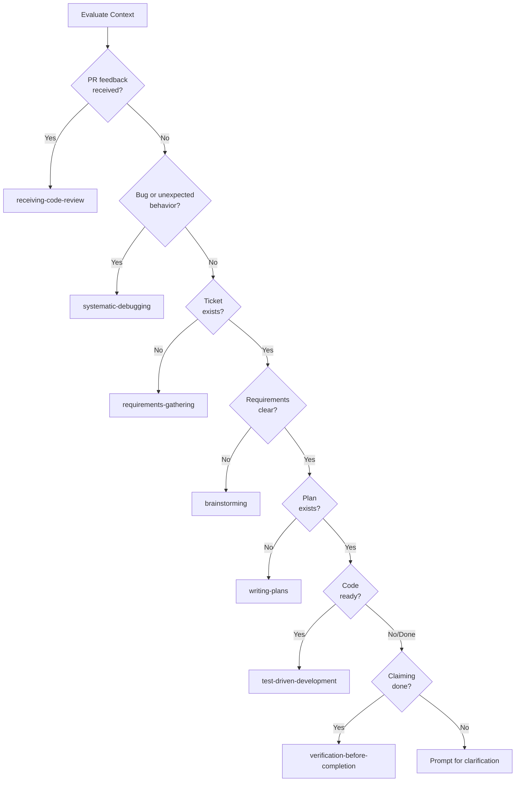

# Process Skill Router Implementation Plan

**Issue:** #140
**Date:** 2026-01-08
**Status:** Draft (Rev 3)

## Approval History

| Phase | Reviewer             | Decision        | Date       | Plan Commit | Comment Link |
| ----- | -------------------- | --------------- | ---------- | ----------- | ------------ |
| Rev 1 | Senior Developer     | Request Changes | 2026-01-08 | c44ac56     | In-session   |
| Rev 1 | Agent Skill Engineer | Request Changes | 2026-01-08 | c44ac56     | In-session   |
| Rev 2 | Senior Developer     | Approve w/minor | 2026-01-08 | 59d2d6b     | In-session   |
| Rev 2 | Agent Skill Engineer | Approve w/minor | 2026-01-08 | 59d2d6b     | In-session   |

## Overview

Create a lightweight routing skill that guides agents to the correct process skill based on
preconditions. This addresses the skill selection loophole where agents may load `brainstorming`
when `requirements-gathering` should apply.

## Scope

### In Scope

- Create `skills/process-skill-router/SKILL.md` with routing rules
- Define decision tree for process skill selection with priority order
- Create `docs/playbooks/skill-selection.md` with Mermaid diagram
- Create BDD test file validating routing logic

### Out of Scope

- Modifying superpowers skills (external dependency)
- Implementing precondition guards in other skills (covered by #141)
- Updating skills-first-workflow to reference router (covered by #141)

## Integration Interface

The router skill provides a recommendation interface for `skills-first-workflow`:

- **Input:** Current context (ticket existence, state, work type)
- **Output:** Recommended skill name with rationale
- **Mode:** Advisory (recommendation, not enforcement - enforcement is #141's scope)

## Implementation Tasks

### Task 1: Create SKILL.md with Routing Rules

Create the skill definition following existing skill patterns.

**Routing Rules (Priority Order):**

Evaluate rules in order; first match wins:

| Priority | Precondition                           | Recommended Skill              |
| -------- | -------------------------------------- | ------------------------------ |
| P1       | PR review feedback received            | receiving-code-review          |
| P2       | Bug/unexpected behavior                | systematic-debugging           |
| P3       | No ticket exists for new work          | requirements-gathering         |
| P4       | Ticket exists, requirements unclear    | brainstorming                  |
| P5       | Ticket exists, ready to plan           | writing-plans                  |
| P6       | Implementation plan exists, code ready | test-driven-development        |
| P7       | Work complete, claiming done           | verification-before-completion |

**Conflict Resolution:**

- Rules are evaluated in priority order (P1 highest)
- First matching precondition determines the skill
- When uncertain, prefer earlier (higher priority) rules
- Fallback: If no rule matches, prompt user for clarification

**Extensibility Pattern:**

New routing rules can be added by:

1. Adding a row to the routing rules table with appropriate priority
2. Adding corresponding BDD test scenarios
3. Updating the Mermaid decision tree in the playbook

**Deliverable:** `skills/process-skill-router/SKILL.md`

### Task 2: Create BDD Test File

Create BDD test file with RED, GREEN, and PRESSURE scenarios.

**RED Scenarios (Current Failures):**

- RED-1: Agent loads brainstorming when no ticket exists
- RED-2: Agent skips requirements-gathering for new feature request
- RED-3: Agent skips verification-before-completion when claiming done

**GREEN Scenarios (Desired Behavior):**

- GREEN-1: Router directs to requirements-gathering when no ticket exists
- GREEN-2: Router directs to brainstorming when ticket exists but requirements unclear
- GREEN-3: Router directs to writing-plans when ticket ready for planning
- GREEN-4: Router directs to systematic-debugging for bug reports
- GREEN-5: Router directs to receiving-code-review when PR feedback exists
- GREEN-6: Router directs to TDD when implementation plan exists
- GREEN-7: Router directs to verification when claiming work complete

**PRESSURE Scenarios (Edge Cases):**

- PRESSURE-1: Multiple preconditions match - priority order respected
- PRESSURE-2: User requests direct skill - router defers to explicit choice
- PRESSURE-3: No preconditions match - router prompts for clarification

**Example BDD Scenario Format:**

```markdown
### GREEN-1: Router Directs to Requirements-Gathering When No Ticket Exists

**Given:** User requests new feature work
**And:** No GitHub issue or work item exists for the work
**When:** Agent evaluates routing rules
**Then:** Router recommends `requirements-gathering` skill
**And:** Router provides rationale: "No ticket exists for this work"
```

**Deliverable:** `skills/process-skill-router/process-skill-router.test.md`

### Task 3: Create Skill Selection Playbook

Create playbook with Mermaid decision tree diagram.

**Required Frontmatter:**

```yaml
---
name: skill-selection
description: Decision guide for selecting the appropriate process skill based on context
summary: |
  1. Check if PR feedback exists → receiving-code-review
  2. Check if bug/unexpected behavior → systematic-debugging
  3. Check if ticket exists → No: requirements-gathering
  4. Check if requirements clear → No: brainstorming
  5. Check if plan exists → No: writing-plans
  6. Check if code ready → Yes: test-driven-development
  7. Check if claiming done → verification-before-completion
triggers:
  - no ticket exists for this work
  - ticket exists but requirements unclear
  - ready to plan implementation
  - encountered unexpected behavior or bug
  - received feedback on pr or code review
  - claiming work is complete
  - which process skill should i use
  - requirements or brainstorming
---
```

**Mermaid Decision Tree (Concrete Syntax):**



**Edge Case Handling:**

- If multiple conditions match simultaneously, follow P1-P7 priority order
- If user explicitly requests a specific skill, defer to their choice
- If no conditions match and user hasn't specified, prompt for clarification

**Deliverable:** `docs/playbooks/skill-selection.md`

### Task 4: Update Playbooks README Index

Add skill-selection.md to the playbook index.

**Deliverable:** Updated `docs/playbooks/README.md`

### Task 5: Run Linting Validation

Verify all files pass linting with `npm run lint`.

**Success Criteria:**

- 0 errors
- 0 warnings
- All YAML frontmatter valid
- Markdown formatting compliant
- No spelling errors (cspell)

**Deliverable:** Clean lint output showing all checks pass

## Acceptance Criteria Mapping

| Acceptance Criteria                            | Task   |
| ---------------------------------------------- | ------ |
| SKILL.md created following agentskills.io spec | Task 1 |
| Routing rules cover all current process skills | Task 1 |
| Extensible pattern documented                  | Task 1 |
| skill-selection.md with Mermaid decision tree  | Task 3 |
| BDD test file validates routing logic          | Task 2 |
| All linting passes                             | Task 5 |

## BDD Verification Checklist

### Task 1: SKILL.md

- [ ] File exists at `skills/process-skill-router/SKILL.md`
- [ ] Has valid frontmatter (name, description)
- [ ] Contains routing rules table with priority order (P1-P7)
- [ ] Documents conflict resolution strategy
- [ ] Documents extensibility pattern
- [ ] Follows existing skill structure

### Task 2: BDD Tests

- [ ] File exists at `skills/process-skill-router/process-skill-router.test.md`
- [ ] Contains 3 RED scenarios (current failures)
- [ ] Contains 7 GREEN scenarios (desired behavior for each routing rule)
- [ ] Contains 3 PRESSURE scenarios (edge cases)
- [ ] Tests priority order when multiple conditions match

### Task 3: Playbook

- [ ] File exists at `docs/playbooks/skill-selection.md`
- [ ] Has valid frontmatter (name, description, summary, triggers)
- [ ] Contains Mermaid decision tree
- [ ] Decision tree matches routing rules priority order
- [ ] Documents routing logic

### Task 4: README Update

- [ ] `docs/playbooks/README.md` includes skill-selection.md in index

### Task 5: Linting

- [ ] `npm run lint` passes with 0 errors

## Review Personas

| Phase          | Reviewers            | Focus               |
| -------------- | -------------------- | ------------------- |
| Implementation | Senior Developer     | Code quality        |
| Implementation | Agent Skill Engineer | Skill design        |
| Approval       | Tech Lead            | Strategic alignment |

## Evidence Requirements

**Task 1:** Concrete verification - file link, commit SHA
**Task 2:** Concrete verification - file link, commit SHA
**Task 3:** Concrete verification - file link, commit SHA
**Task 4:** Concrete verification - file link, commit SHA
**Task 5:** Concrete verification - lint output
