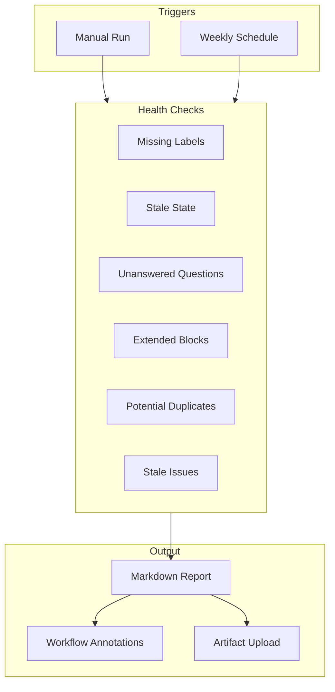

# Backlog Health Report Playbook

## Overview

This playbook describes how to configure and use the backlog health report script,
which analyzes your issue backlog to identify items needing attention before they
become problems.

## When to Use

- **Sprint Planning**: Run before sprint planning to identify blockers
- **Monthly Grooming**: Schedule for monthly backlog grooming sessions
- **Backlog Threshold**: Run when open issue count exceeds comfortable levels
- **Post-Milestone**: Review health after major milestones

## How It Works



## Health Check Categories

| Category             | Detection                                | Severity | Action Required              |
| -------------------- | ---------------------------------------- | -------- | ---------------------------- |
| Missing Labels       | Issues without required labels for state | Warning  | Add labels before transition |
| Stale State          | `state:new-feature` > N days             | Warning  | Move to grooming or close    |
| Unanswered Questions | `needs-info` label present               | Warning  | Respond or close             |
| Extended Blocks      | `blocked` label > N days                 | Alert    | Escalate or resolve blocker  |
| Potential Duplicates | Similar titles detected                  | Info     | Review and link/merge        |
| Stale Issues         | No activity > N days                     | Warning  | Close or re-activate         |

## Configuration

### Step 1: Copy Template Files

Copy templates to your repository:

```bash
# Script
cp skills/issue-driven-delivery/templates/backlog-health.sh scripts/backlog-health.sh
chmod +x scripts/backlog-health.sh

# Workflow
cp skills/issue-driven-delivery/templates/backlog-health.yml .github/workflows/backlog-health.yml
```

### Step 2: Customize Thresholds

The script uses environment variables for thresholds. Modify the workflow file
to customize for your repository:

```yaml
env:
  STALE_DAYS: "30" # Days without activity
  BLOCKED_DAYS: "14" # Days in blocked state
  NEW_FEATURE_DAYS: "7" # Days in new-feature state
```

**Threshold Guidelines:**

| Repository Type | STALE_DAYS | BLOCKED_DAYS | NEW_FEATURE_DAYS |
| --------------- | ---------- | ------------ | ---------------- |
| Active project  | 30         | 14           | 7                |
| Maintenance     | 60         | 30           | 14               |
| High-velocity   | 14         | 7            | 3                |

### Step 3: Set Schedule

The default schedule is Monday 9 AM UTC. Modify in the workflow file:

```yaml
schedule:
  # Weekly on Monday at 9 AM UTC
  - cron: "0 9 * * MON"
```

**Schedule Examples:**

| Frequency | Cron Expression | When                  |
| --------- | --------------- | --------------------- |
| Weekly    | `0 9 * * MON`   | Monday 9 AM UTC       |
| Bi-weekly | `0 9 1,15 * *`  | 1st and 15th of month |
| Monthly   | `0 9 1 * *`     | First of each month   |
| Daily     | `0 9 * * *`     | Every day 9 AM UTC    |

## Running the Report

### Manual Trigger

1. Go to **Actions** tab in GitHub
2. Select **Backlog Health Report** workflow
3. Click **Run workflow**
4. Optionally override thresholds
5. Click **Run workflow** button

### Command Line

Run locally for testing:

```bash
# With defaults
./scripts/backlog-health.sh

# With custom thresholds
STALE_DAYS=60 BLOCKED_DAYS=7 ./scripts/backlog-health.sh

# With debug output
DEBUG=true ./scripts/backlog-health.sh
```

## Output Interpretation

### Report Structure

The report contains these sections:

1. **Configuration** - Shows threshold values used
2. **Summary** - Counts of warnings and alerts
3. **Missing Labels** - Issues without required labels
4. **Stale State** - Issues in new-feature too long
5. **Unanswered Questions** - Issues awaiting response
6. **Extended Blocks** - Long-blocked issues (ALERT)
7. **Potential Duplicates** - Similar issue pairs
8. **Stale Issues** - Inactive issues
9. **Recommendations** - Suggested actions

### Example Output

```markdown
# Backlog Health Report

**Generated:** 2026-01-08T10:00:00+00:00

## Configuration

| Threshold        | Value |
| ---------------- | ----- |
| Stale Days       | 30    |
| Blocked Days     | 14    |
| New Feature Days | 7     |

## Summary

| Category | Count | Severity |
| -------- | ----- | -------- |
| Warnings | 5     | Warning  |
| Alerts   | 1     | Alert    |

## Missing Labels

| Issue | Title                   | Missing      |
| ----- | ----------------------- | ------------ |
| #123  | Add user authentication | component:\* |
| #124  | Fix login validation    | work-type:\* |

## Extended Blocks

**Severity: Alert** - Issues blocked for more than 14 days require attention.

| Issue | Title                   | Duration        |
| ----- | ----------------------- | --------------- |
| #100  | Depends on external API | 21 days blocked |

## Recommendations

### Immediate Actions

- **Extended Blocks**: Review blocked issues and escalate or resolve blockers
- **Missing Labels**: Add required labels before state transitions
```

### Exit Codes

| Code | Meaning       | Action                                  |
| ---- | ------------- | --------------------------------------- |
| 0    | Healthy       | No action required                      |
| 1    | Warnings      | Review and address during next grooming |
| 2    | Alerts/Errors | Immediate attention required            |

## Recommended Actions by Category

### Missing Labels

**Symptoms:** Issues transitioned without proper categorization.

**Actions:**

1. Review each flagged issue
2. Add appropriate `component:*` label (e.g., `component:api`, `skill`)
3. Add appropriate `work-type:*` label (e.g., `work-type:new-feature`)
4. Consider if label validation workflow should block transitions

### Stale State

**Symptoms:** Issues in `state:new-feature` for too long without grooming.

**Actions:**

1. Review if issue is still relevant
2. If relevant: Move to `state:grooming` for backlog grooming
3. If not relevant: Close with explanation
4. If duplicate: Link to existing issue and close

### Unanswered Questions

**Symptoms:** Issues marked `needs-info` waiting for stakeholder response.

**Actions:**

1. Check if question is still blocking
2. Ping stakeholder for response
3. If no response after 2 weeks: Escalate or close
4. If question resolved: Remove `needs-info` label

### Extended Blocks

**Symptoms:** Issues blocked for extended period without resolution.

**Actions:**

1. Review blocking dependency
2. If blocker is in progress: Check estimated completion
3. If blocker is stalled: Escalate to Tech Lead
4. If blocker is external: Document timeline or find workaround
5. Consider: Can issue be unblocked by changing approach?

### Potential Duplicates

**Symptoms:** Multiple issues covering similar scope.

**Actions:**

1. Review flagged pairs
2. If true duplicate: Close newer one, link to original
3. If related but distinct: Link issues, clarify scope in each
4. If false positive: No action (different enough)

### Stale Issues

**Symptoms:** Issues with no activity for extended period.

**Actions:**

1. Review if issue is still relevant
2. If work completed elsewhere: Close with reference
3. If superseded by newer issue: Close and link
4. If still needed: Update with current status, re-prioritize
5. If blocked but not labeled: Add `blocked` label with reason

## Troubleshooting

### Script Not Found

```text
::error title=Script Not Found::scripts/backlog-health.sh not found
```

**Fix:** Ensure script is copied to `scripts/backlog-health.sh` and committed.

### API Rate Limit

```text
::warning title=Rate Limit::API rate limit is low
```

**Fix:** Wait for rate limit reset or reduce `--limit` in script.

### Configuration Error

```text
::error title=Invalid Config::STALE_DAYS must be a positive integer
```

**Fix:** Ensure environment variables are valid positive integers.

### No Issues Analyzed

**Symptoms:** Report shows zero issues.

**Causes:**

- Repository has no open issues (healthy!)
- Script permissions insufficient (check workflow permissions)
- API authentication failed (check GH_TOKEN)

## See Also

- [ticket-lifecycle.md](ticket-lifecycle.md) - Issue state transitions
- [label-validation.md](label-validation.md) - Label requirements per state
- [duplicate-detection.md](duplicate-detection.md) - Duplicate detection workflow
- [issue-driven-delivery](../../skills/issue-driven-delivery/SKILL.md) - Full workflow skill
