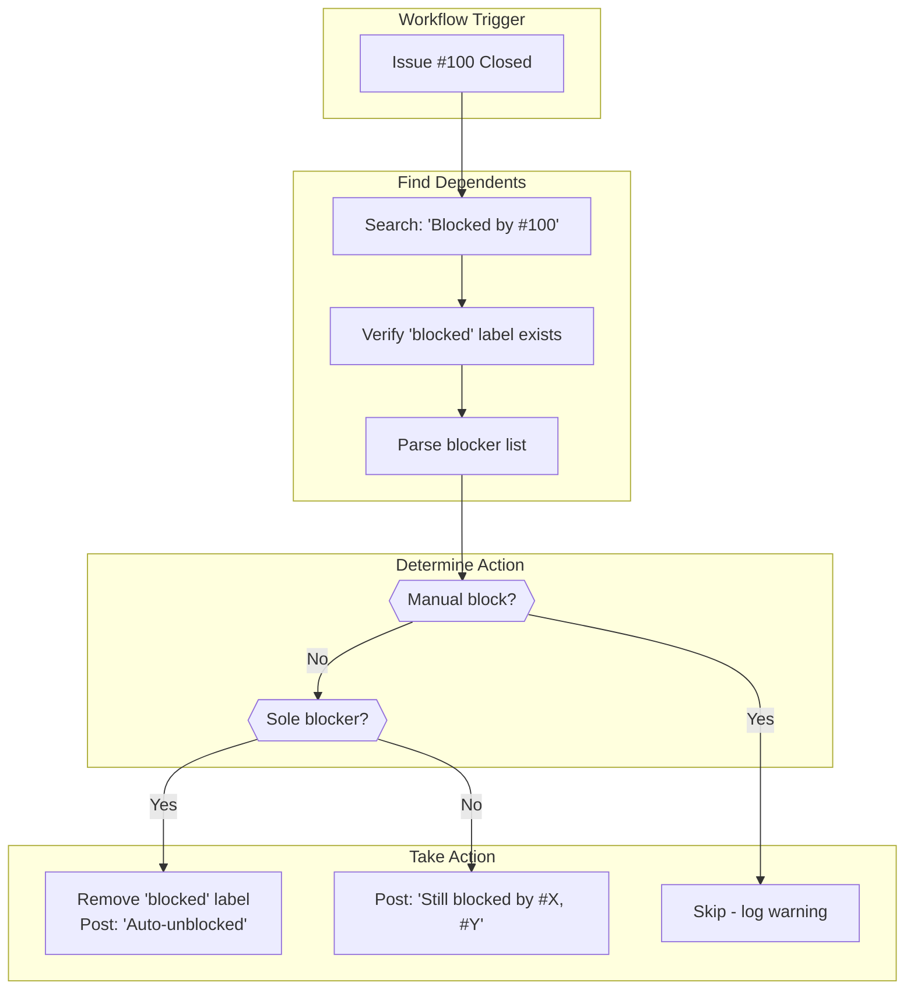

# Blocked Status Sync Playbook

## Overview

This playbook describes how to configure and use the blocked status sync workflow,
which automatically manages the "blocked" label lifecycle as blocking issues are resolved.

## How It Works



## Blocking Pattern Format

The workflow recognizes these "Blocked by" patterns in issue body or comments:

| Pattern                      | Example                  | Notes                      |
| ---------------------------- | ------------------------ | -------------------------- |
| `Blocked by: #N`             | Blocked by: #100         | Standard format with colon |
| `Blocked by #N`              | Blocked by #100          | Without colon              |
| `Blocked by: #N, #M, #O`     | Blocked by: #100, #101   | Multiple blockers          |
| `blocked by #N` (lowercase)  | blocked by #100          | Case-insensitive           |
| `Blocked by #N (with notes)` | Blocked by #100 (reason) | Notes after are ignored    |

**Required for detection:**

1. Issue must have the `blocked` label
2. Issue body or comment must contain "Blocked by" pattern with issue number

## Manual Block Keywords

Issues with these keywords in the blocking statement are **NOT** auto-unblocked:

- `waiting for`
- `external`
- `approval`
- `client`
- `vendor`
- `third party`

**Example (skipped):**

```text
Blocked by: #100 (waiting for external approval)
```

## Configuration

### Step 1: Copy Script

Ensure the unblock script exists at `scripts/issue-driven-delivery/unblock-dependents.sh`.

The script is included in this repository. For other repositories, copy it from:
`skills/issue-driven-delivery/scripts/unblock-dependents.sh` (if packaged separately).

### Step 2: Copy Workflow

Copy the template from `skills/issue-driven-delivery/templates/sync-blocked-status.yml`
to `.github/workflows/auto-unblock.yml` (or `sync-blocked-status.yml`).

### Step 3: Verify Permissions

The workflow requires `issues: write` permission. This is set in the template but verify
your repository allows this permission for Actions.

## Script Usage

The unblock script can also be run manually for testing or maintenance:

```bash
# Dry-run: See what would happen
./scripts/issue-driven-delivery/unblock-dependents.sh 100

# Apply changes
./scripts/issue-driven-delivery/unblock-dependents.sh 100 --apply

# Show dependency graph
./scripts/issue-driven-delivery/unblock-dependents.sh 100 --graph

# Auto-detect recently closed issues
./scripts/issue-driven-delivery/unblock-dependents.sh --graph
```

### Script Options

| Option    | Description                                |
| --------- | ------------------------------------------ |
| (number)  | Issue number to process                    |
| `--apply` | Actually make changes (dry-run by default) |
| `--graph` | Show dependency graph (ASCII or Mermaid)   |
| `--help`  | Show help message                          |

### Graph Output

**Terminal (ASCII):**

```text
Dependency Graph (issues blocked by #100):
=============================================

  #100 (closed/processing)
    ├── #101 (will unblock) - Implement feature X
    ├── #102 (still blocked by #103, #104) - Deploy...
    └── #105 (will unblock) - Update documentation
```

**Piped (Mermaid):**

```text
graph TD
    100["#100 (closed)"]
    100 --> 101["#101"]
    100 --> 102["#102"]
    100 --> 105["#105"]
```

## Circular Dependency Detection

The script detects circular dependencies and suggests resolution:

```text
[WARN] Circular dependency detected: #101 #102 #103 #101

Resolution suggestion based on rework-cost heuristics:

  #101: LOW rework cost
  #102: MEDIUM rework cost
  #103: HIGH rework cost

Recommendation: Unblock the issue with LOWEST rework cost first.
Create a follow-up task for rework after the cycle completes.
```

### Rework Cost Estimation

| Cost   | Keywords in blocking statement            |
| ------ | ----------------------------------------- |
| LOW    | interface, mock, stub, config             |
| HIGH   | schema, migration, architecture, breaking |
| MEDIUM | (default)                                 |

## Troubleshooting

### Issue: Dependent not unblocked

**Check 1:** Does the dependent issue have the `blocked` label?

```bash
gh issue view 101 --json labels --jq '.labels[].name'
```

**Check 2:** Does the body/comment contain the exact pattern?

```bash
gh issue view 101 --json body,comments \
  --jq '([.body] + [.comments[].body]) | .[] | select(test("(?i)blocked by"))'
```

**Check 3:** Is it a manual block?

Look for keywords: "waiting for", "external", "approval", "client", "vendor".

### Issue: Workflow not triggering

**Check:** Is the workflow file in `.github/workflows/`?

**Check:** Is the trigger correct?

```yaml
on:
  issues:
    types: [closed]
```

### Issue: Script fails with permission error

**Check:** GitHub token has `issues: write` permission.

**Check:** Script is executable:

```bash
chmod +x ./scripts/issue-driven-delivery/unblock-dependents.sh
```

### Issue: False positives in search

The script verifies each search result:

1. Must have `blocked` label
2. Must have `Blocked by: #N` pattern (not just mentioned)

If false positives occur, check for text that coincidentally matches the pattern.

### Issue: Want to test without changes

Run the script without `--apply`:

```bash
./scripts/issue-driven-delivery/unblock-dependents.sh 100
# Shows [DRY-RUN] prefix for all actions
```

## Integration with Other Workflows

This workflow complements:

- **validate-labels.yml** - Ensures `blocked` label is applied correctly
- **sync-project-status.yml** - Updates project board when blocked status changes
- **detect-duplicates.yml** - May find blocked issues as potential duplicates

## See Also

- `skills/issue-driven-delivery/templates/sync-blocked-status.yml` - Template workflow
- `.github/workflows/auto-unblock.yml` - Installed workflow
- `scripts/issue-driven-delivery/unblock-dependents.sh` - Core script
- `docs/playbooks/ticket-lifecycle.md` - Issue state transitions
