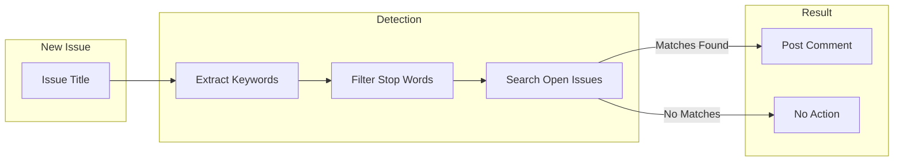

# Duplicate Detection Playbook

## Overview

This playbook describes how to configure and use the duplicate detection workflow,
which automatically identifies potentially duplicate issues when new issues are created.

## How It Works



## Detection Logic

### Step 1: Keyword Extraction

The workflow extracts significant words from the issue title:

1. Convert to lowercase
2. Remove special characters
3. Filter out stop words (common words)
4. Filter out short words (< 3 characters)

**Example:**

```text
Title: "Add user authentication feature"
After filtering: "user", "authentication"
```

### Step 2: Search

The remaining keywords are used to search existing open issues:

```bash
gh issue list --search "user authentication in:title is:open"
```

### Step 3: Results

- **Matches found:** Comment posted with links to potential duplicates
- **No matches:** No action taken
- **Too few keywords:** Detection skipped

## Configuration

### Step 1: Copy Template

Copy the template from `skills/issue-driven-delivery/templates/detect-duplicates.yml`
to `.github/workflows/detect-duplicates.yml`.

### Step 2: Customize Stop Words

Update the `STOP_WORDS` environment variable to include domain-specific common words:

```yaml
STOP_WORDS: "a an the is ... skill skills automation script workflow"
```

Add words that are common in your repository but not meaningful for duplicate detection.

### Step 3: Adjust Thresholds

| Variable       | Default | Description                          |
| -------------- | ------- | ------------------------------------ |
| `MIN_KEYWORDS` | 2       | Minimum keywords needed to search    |
| `MAX_MATCHES`  | 5       | Maximum potential duplicates to show |

## Comment Format

When potential duplicates are found, the workflow posts:

```markdown
## Potential Duplicates Detected

The following open issues may be related to this one:

| Issue | Title                 |
| ----- | --------------------- |
| #123  | Similar issue title   |
| #456  | Another similar title |

Please review these issues. If this is a duplicate, consider:

- Closing this issue as duplicate of the original
- Linking issues if they are related but distinct

---

_This comment was automatically generated by the duplicate detection workflow._
```

## Handling Results

### When Duplicates Are Found

1. **Review** the listed issues to determine if they are truly duplicates
2. **If duplicate:** Close the new issue with a comment referencing the original
3. **If related but distinct:** Link the issues and proceed with both

### False Positives

The detection is based on keyword matching, so false positives can occur when:

- Different features share common terminology
- Issues are related but not duplicates

**Best practice:** Always review matches manually before closing as duplicate.

## Troubleshooting

### Issue: Too many false positives

**Solution:** Add domain-specific terms to `STOP_WORDS` that are common but not
meaningful for duplicate detection.

### Issue: Workflow not triggering

**Check 1:** Is the workflow file in `.github/workflows/`?

**Check 2:** Is the trigger correct?

```yaml
on:
  issues:
    types: [opened]
```

### Issue: No duplicates detected for obvious duplicate

**Check 1:** Are keywords being extracted? Check workflow logs for "Extracted keywords".

**Check 2:** Is the original issue still OPEN? Closed issues are not searched.

**Check 3:** Are the matching words being filtered as stop words?

### Issue: Comment not being posted

**Check:** Does the workflow have `issues: write` permission?

```yaml
permissions:
  issues: write
```

## Limitations

1. **Title-only matching:** Currently only searches issue titles, not bodies
2. **Keyword-based:** Simple keyword matching, not semantic similarity
3. **Open issues only:** Does not search closed issues
4. **Same repository:** Does not search across repositories

## See Also

- `skills/issue-driven-delivery/templates/detect-duplicates.yml` - Template workflow
- `.github/workflows/detect-duplicates.yml` - Installed workflow
- `docs/playbooks/ticket-lifecycle.md` - Issue grooming process
- `skills/issue-driven-delivery/references/component-tagging.md` - Label conventions
