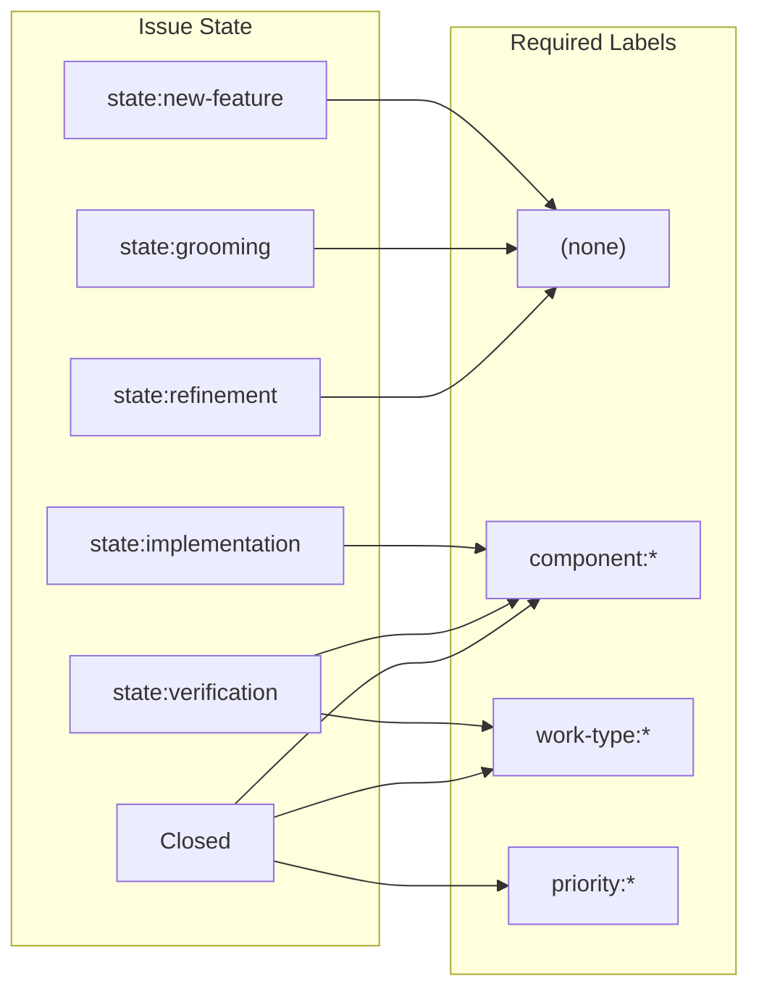

# Label Validation Playbook

## Overview

This playbook describes how to configure and use the label validation workflow,
which ensures issues have required labels at each workflow state.

## Validation Rules



| State Transition         | Required Labels                            | Enforcement |
| ------------------------ | ------------------------------------------ | ----------- |
| → `state:new-feature`    | (none)                                     | N/A         |
| → `state:grooming`       | (none)                                     | N/A         |
| → `state:refinement`     | (none)                                     | N/A         |
| → `state:implementation` | `component:*`                              | Warning     |
| → `state:verification`   | `component:*`, `work-type:*`               | Warning     |
| → Issue Closed           | `component:*`, `work-type:*`, `priority:*` | Error       |

## Why These Rules?

**Component label (implementation):** Before development starts, we must know
which area of the codebase is affected. This enables:

- Code review assignment
- Impact analysis
- Changelog generation

**Work-type label (verification):** Before testing, we must categorize the work.
This enables:

- Test strategy selection
- Release note categorization
- Sprint metrics

**Priority label (close):** Before closure, priority must be recorded for:

- Retrospective analysis
- Capacity planning
- Process improvement metrics

## Configuration

### Step 1: Copy Template

Copy the template from `skills/issue-driven-delivery/templates/validate-labels.yml`
to `.github/workflows/validate-labels.yml`.

### Step 2: Customize Label Patterns

Update the environment variables to match your repository's label conventions:

| Variable                  | Default Pattern | Description                |
| ------------------------- | --------------- | -------------------------- |
| `LABEL_COMPONENT_PATTERN` | `^component:`   | Regex for component labels |
| `LABEL_WORKTYPE_PATTERN`  | `^work-type:`   | Regex for work-type labels |
| `LABEL_PRIORITY_PATTERN`  | `^priority:`    | Regex for priority labels  |

**This repository's configuration:**

```yaml
LABEL_COMPONENT_PATTERN: "^(component:|skill$)"
```

This accepts both `component:*` labels and the plain `skill` label as valid
component identifiers.

### Step 3: Customize State Labels

If your repository uses different state label names, update:

```yaml
STATE_IMPLEMENTATION: "state:implementation"
STATE_VERIFICATION: "state:verification"
STATE_NEW_FEATURE: "state:new-feature"
STATE_GROOMING: "state:grooming"
STATE_REFINEMENT: "state:refinement"
```

## Understanding Output

### Warning Messages

Warnings appear in the workflow output for non-critical missing labels:

```text
::warning title=Missing Component Label::Issue requires a 'component:*' label
```

Warnings do not fail the workflow but indicate labels should be added.

### Error Messages

Errors appear for critical missing labels (e.g., priority on close):

```text
::error title=Missing Priority Label::Issue requires a 'priority:*' label before closing
```

Errors indicate a compliance issue that should be addressed.

## Troubleshooting

### Issue: Workflow not triggering

**Check 1:** Is the workflow file in `.github/workflows/`?

**Check 2:** Are the trigger events correct?

```yaml
on:
  issues:
    types: [labeled, unlabeled, closed]
```

### Issue: Wrong labels being validated

**Check:** Label pattern regex is correct.

Test your regex:

```bash
echo "component:api" | grep -qE "^component:" && echo "MATCH" || echo "NO MATCH"
```

### Issue: Validation too strict

**Solution:** Early lifecycle states (new-feature, grooming, refinement) skip
validation by design. If you need to skip validation for other states, add them
to the skip check in the workflow.

### Issue: Want to block instead of warn

The current design only warns/reports but does not block. To implement blocking:

1. Change `exit 0` to `exit 1` when errors are found
2. Add a branch protection rule requiring the workflow to pass

**Note:** Blocking can cause friction. Consider whether warnings are sufficient
for your team's workflow.

## Label Patterns for This Repository

| Label Pattern | Examples                                  |
| ------------- | ----------------------------------------- |
| `component:*` | component:api, component:docs             |
| `skill`       | skill (standalone, accepted as component) |
| `work-type:*` | work-type:new-feature, work-type:bug      |
| `priority:*`  | priority:p0, priority:p1, priority:p2     |

## See Also

- `skills/issue-driven-delivery/templates/validate-labels.yml` - Template workflow
- `.github/workflows/validate-labels.yml` - Installed workflow
- `docs/playbooks/ticket-lifecycle.md` - Issue state transitions
- `skills/issue-driven-delivery/references/component-tagging.md` - Label taxonomy
