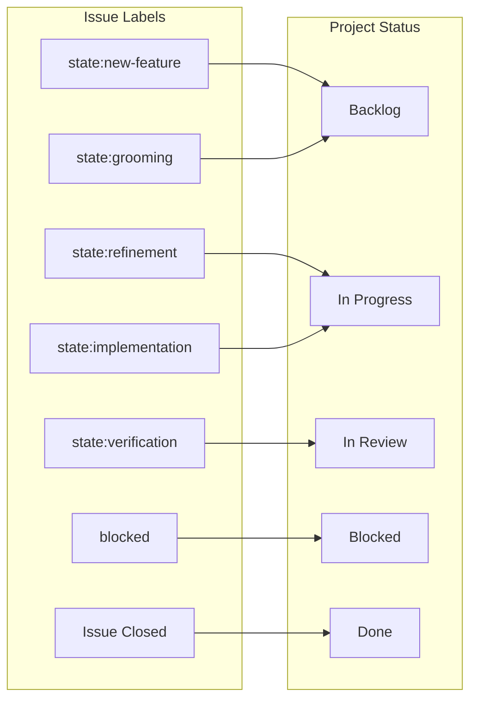

# Project Status Sync Playbook

## Overview

This playbook describes how to configure and use the project status sync workflow,
which automatically updates GitHub Project board status based on issue state labels.

## Sync Flow



## Priority Rules

The workflow applies status in this priority order:

1. **Issue Closed** → Done (highest priority)
2. **blocked label** → Blocked (overrides state labels)
3. **State labels** → Corresponding status
4. **No state label** → Backlog (default)

## Configuration

### Step 1: Get Project Information

```bash
# List your projects to find the project number
gh project list --owner YOUR_USERNAME

# Get project node ID
gh project view PROJECT_NUMBER --owner YOUR_USERNAME --format json --jq '.id'

# Get status field configuration
gh project field-list PROJECT_NUMBER --owner YOUR_USERNAME --format json \
  --jq '.fields[] | select(.name == "Status")'
```

### Step 2: Configure Workflow

Copy the template from `skills/issue-driven-delivery/templates/sync-project-status.yml`
to `.github/workflows/sync-project-status.yml` and update these environment variables:

| Variable             | Description                      | How to Find               |
| -------------------- | -------------------------------- | ------------------------- |
| `PROJECT_NUMBER`     | Project number from URL          | URL: `.../projects/N`     |
| `PROJECT_NODE_ID`    | Project's GraphQL node ID        | `gh project view` command |
| `STATUS_FIELD_ID`    | Status field's node ID           | `gh project field-list`   |
| `STATUS_BACKLOG`     | Option ID for Backlog status     | From field-list `options` |
| `STATUS_READY`       | Option ID for Ready status       | From field-list `options` |
| `STATUS_IN_PROGRESS` | Option ID for In Progress status | From field-list `options` |
| `STATUS_IN_REVIEW`   | Option ID for In Review status   | From field-list `options` |
| `STATUS_DONE`        | Option ID for Done status        | From field-list `options` |
| `STATUS_BLOCKED`     | Option ID for Blocked status     | From field-list `options` |

### Step 3: Ensure Permissions

The workflow requires these permissions:

```yaml
permissions:
  issues: read
  repository-projects: write
```

The `GITHUB_TOKEN` must have project access. For organisation projects, you may
need a Personal Access Token with `project` scope.

## Troubleshooting

### Issue: Status not updating

**Check 1:** Is the issue added to the project?

```bash
gh issue view ISSUE_NUMBER --json projectItems
```

If `projectItems` is empty, add the issue to the project first.

**Check 2:** Does the workflow have project permissions?

Check workflow run logs for permission errors. Organisation projects may
require additional token configuration.

### Issue: Wrong status applied

**Check:** Label priority order

The workflow checks labels in priority order (blocked > verification > implementation, etc.).
If multiple state labels exist, the highest priority wins.

**Fix:** Remove conflicting state labels before adding the correct one.

### Issue: Workflow not triggering

**Check:** Workflow is enabled in repository settings.

**Check:** The issue event type is in the workflow trigger:

```yaml
on:
  issues:
    types: [labeled, unlabeled, closed, reopened]
```

## Label to Status Mapping (This Repository)

| Label                  | Status      |
| ---------------------- | ----------- |
| `state:new-feature`    | Backlog     |
| `state:grooming`       | Backlog     |
| `state:refinement`     | In Progress |
| `state:implementation` | In Progress |
| `state:verification`   | In Review   |
| `blocked`              | Blocked     |
| Issue closed           | Done        |

## See Also

- `skills/issue-driven-delivery/templates/sync-project-status.yml` - Template workflow
- `.github/workflows/sync-project-status.yml` - Installed workflow
- `docs/playbooks/ticket-lifecycle.md` - Issue state transitions
- `skills/issue-driven-delivery/references/state-tracking.md` - State definitions
