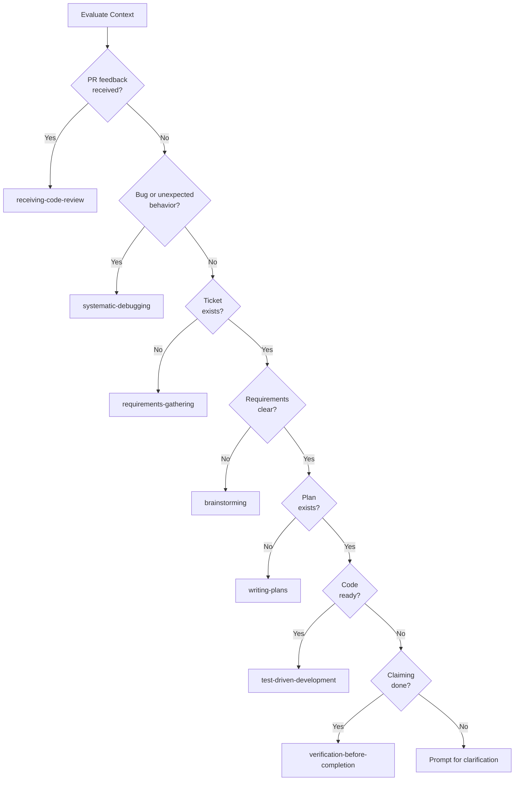

# Skill Selection Playbook

## Overview

This playbook guides agents to the correct process skill based on current context. It
addresses the skill selection loophole where agents may load the wrong skill for their
situation (e.g., `brainstorming` when `requirements-gathering` should apply).

## Decision Tree

## Priority Rules

Rules are evaluated in order. First matching condition determines the skill.

| Priority | Precondition                           | Recommended Skill              |
| -------- | -------------------------------------- | ------------------------------ |
| P1       | PR review feedback received            | receiving-code-review          |
| P2       | Bug/unexpected behavior                | systematic-debugging           |
| P3       | No ticket exists for new work          | requirements-gathering         |
| P4       | Ticket exists, requirements unclear    | brainstorming                  |
| P5       | Ticket exists, ready to plan           | writing-plans                  |
| P6       | Implementation plan exists, code ready | test-driven-development        |
| P7       | Work complete, claiming done           | verification-before-completion |

## Edge Case Handling

### Multiple Conditions Match

When multiple conditions match simultaneously, use priority order:

- P1 beats all others (PR feedback takes precedence)
- P2 beats P3-P7 (debugging takes precedence over workflow)
- Earlier priority always wins

**Example:** Bug reported + no ticket exists

- P2 (systematic-debugging) wins over P3 (requirements-gathering)
- Fix the bug first, then create ticket if needed

### User Explicitly Requests Skill

When user explicitly says "use X skill":

- Defer to user's choice
- Provide recommendation as advisory only
- Do not override explicit requests

### No Conditions Match

When context is ambiguous:

- Do not make arbitrary recommendations
- Prompt user for clarification
- Ask: "What are you trying to accomplish?"

## Quick Reference

| Situation                         | Use This Skill                 |
| --------------------------------- | ------------------------------ |
| PR has reviewer comments          | receiving-code-review          |
| Test failing, unexpected error    | systematic-debugging           |
| New feature request, no ticket    | requirements-gathering         |
| Ticket exists, reqs are fuzzy     | brainstorming                  |
| Ticket ready, need implementation | writing-plans                  |
| Plan approved, time to code       | test-driven-development        |
| Code done, about to mark complete | verification-before-completion |

## Common Mistakes

### Mistake 1: Brainstorming Without Ticket

**Wrong:** User asks for new feature → load brainstorming
**Right:** User asks for new feature → load requirements-gathering (create ticket first)

### Mistake 2: Ignoring PR Feedback

**Wrong:** PR feedback exists → continue with TDD
**Right:** PR feedback exists → load receiving-code-review (address feedback first)

### Mistake 3: Skipping Verification

**Wrong:** Code complete → mark done
**Right:** Code complete → load verification-before-completion (verify first)

## See Also

- `skills/process-skill-router/SKILL.md` - Detailed routing skill
- `skills/requirements-gathering/SKILL.md` - Creating tickets
- `skills/issue-driven-delivery/SKILL.md` - Work item lifecycle
