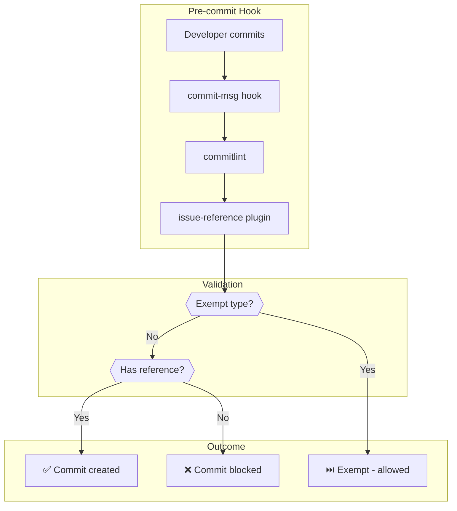

# Standards Compliance Playbook

## Overview

This playbook describes how to configure and use the issue reference validation system,
which ensures all commits reference a GitHub issue for traceability.

## How It Works



## Valid Reference Formats

| Format            | Example                          | When to Use               |
| ----------------- | -------------------------------- | ------------------------- |
| `Refs: #N`        | `Refs: #123`                     | Standard issue reference  |
| `Refs: #N, #M`    | `Refs: #123, #456`               | Multiple related issues   |
| `Fixes: #N`       | `Fixes: #789`                    | Bug fix that closes issue |
| `Closes: #N`      | `Closes: #100`                   | Closes issue on merge     |
| `(#N)` in subject | `feat(api): add endpoint (#123)` | PR number convention      |

## Exempt Commit Types

These commit types do not require issue references:

| Type       | Pattern                      | Example                         |
| ---------- | ---------------------------- | ------------------------------- |
| Merge      | Subject starts with "Merge"  | `Merge branch 'feat' into main` |
| Revert     | Subject starts with "Revert" | `Revert "feat: broken change"`  |
| Dependabot | Author contains "dependabot" | Automated dependency updates    |
| Renovate   | Author contains "renovate"   | Automated dependency updates    |
| Release    | Subject contains "release"   | `chore: release v1.2.0`         |
| Initial    | Subject is "Initial commit"  | Repository initialisation       |

## Configuration

### Step 1: Install Dependencies

Ensure commitlint is installed:

```bash
npm install --save-dev @commitlint/cli @commitlint/config-conventional
```

### Step 2: Copy Plugin

Copy the issue reference plugin to your repository:

```bash
cp skills/issue-driven-delivery/templates/commitlint-issue-reference.cjs \
   scripts/commitlint-issue-reference.cjs
```

Or copy from `scripts/commitlint-issue-reference.cjs` if already in this repository.

### Step 3: Configure Commitlint

Update `commitlint.config.cjs` to include the plugin:

```javascript
const issueReferencePlugin = require("./scripts/commitlint-issue-reference.cjs");

module.exports = {
  extends: ["@commitlint/config-conventional"],
  plugins: [issueReferencePlugin],
  rules: {
    "issue-reference": [2, "always"],
  },
};
```

### Step 4: Configure Git Hook

Ensure `.husky/commit-msg` runs commitlint:

```bash
npx --no-install commitlint --edit "$1"
```

### Step 5: Install CI Workflow

Copy the template workflow to your `.github/workflows/` directory:

```bash
cp skills/issue-driven-delivery/templates/check-issue-reference.yml \
   .github/workflows/check-issue-reference.yml
```

## Example Commit Messages

### Valid - Standard Reference

```text
feat(api): add user authentication endpoint

Implement JWT-based authentication for the API layer.
This includes token generation, validation, and refresh.

Refs: #123
```

### Valid - Fixing Reference

```text
fix(auth): resolve token expiry race condition

The token was expiring before the refresh could complete.
Added a buffer period to prevent the race condition.

Fixes: #456

Co-Authored-By: Claude Opus 4.5 <noreply@anthropic.com>
```

### Valid - PR Convention

```text
feat(ui): add dark mode toggle (#789)

Implement system preference detection and manual override.
```

### Invalid - Missing Reference

```text
feat(api): add new endpoint

This adds a new API endpoint for user profiles.
```

**Error:**

```text
✖   Commit message must reference an issue (e.g., Refs: #123, Fixes: #456, or (#123) in subject)
```

## Troubleshooting

### Issue: Commit blocked unexpectedly

**Check 1:** Does your message contain a valid reference?

```bash
echo "your commit message" | npx commitlint
```

**Check 2:** Is the reference format correct?

- Must use `#` followed by digits
- `Refs: #123` not `Refs: 123` or `Issue 123`

### Issue: Want to commit without reference (emergency)

Use `--no-verify` to bypass:

```bash
git commit --no-verify -m "emergency: hotfix without issue"
```

**Warning:** This bypasses all pre-commit checks. Use sparingly.

### Issue: CI failing but local commit worked

The CI validates ALL commits in the PR, not just the latest. Check if earlier
commits in the PR are missing references.

### Issue: Dependabot commits failing

Dependabot commits are exempt by author check. If failing:

**Check:** CI workflow is checking author name correctly

```bash
git log -1 --format="%an" <sha>
```

Should contain "dependabot" (case-insensitive).

### Issue: Merge commits failing locally

Merge commits should be exempt. If failing:

**Check:** The commit message starts with "Merge "

```bash
git log -1 --format="%s" | grep "^Merge "
```

## Understanding CI Output

The CI workflow generates a summary table:

| Status     | Commit    | Message                  |
| ---------- | --------- | ------------------------ |
| ✅ Pass    | `abc1234` | feat: add feature (#123) |
| ❌ Fail    | `def5678` | fix: broken commit       |
| ⏭️ Skipped | `ghi9012` | chore: deps (automated)  |

### Status Meanings

- **✅ Pass**: Valid issue reference found
- **❌ Fail**: Missing or invalid reference
- **⏭️ Skipped**: Exempt commit type (automated, merge, revert)

## Integration with Other Standards

This validation complements:

- **Conventional Commits** - Enforced by @commitlint/config-conventional
- **GPG Signing** - Required by pre-commit hook (separate check)
- **Branch Protection** - Prevents direct commits to main

## See Also

- `scripts/commitlint-issue-reference.cjs` - Custom plugin implementation
- `commitlint.config.cjs` - Commitlint configuration
- `.husky/commit-msg` - Git hook configuration
- `.github/workflows/check-issue-reference.yml` - CI workflow
- `skills/issue-driven-delivery/templates/check-issue-reference.yml` - Template workflow
