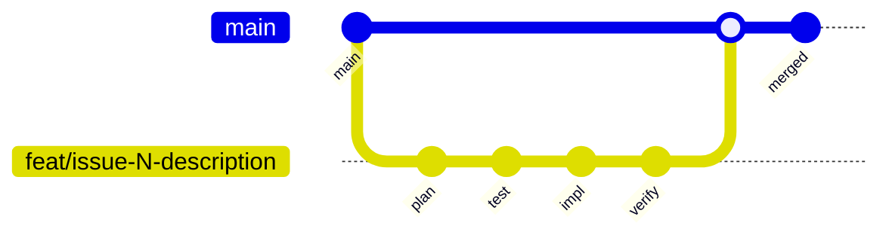

# Ticket Lifecycle Playbook

## Overview

This playbook documents the complete lifecycle of a work item from creation through
completion, including all state transitions, role responsibilities, and quality gates.

## Lifecycle Diagram

```mermaid
stateDiagram-v2
    [*] --> NewFeature: Issue created
    NewFeature --> Grooming: Backlog review begins

    state Grooming {
        [*] --> ReqsValidation
        ReqsValidation --> Categorization
        Categorization --> DuplicateCheck
        DuplicateCheck --> BlockedCheck
        BlockedCheck --> FollowUpReview
        FollowUpReview --> StandardsCheck
        StandardsCheck --> [*]
    }

    Grooming --> Refinement: All activities pass
    Grooming --> Closed: Duplicate detected

    state Refinement {
        [*] --> CreatePlan
        CreatePlan --> RequestApproval
        RequestApproval --> AddressFeedback
        AddressFeedback --> PlanApproved
        PlanApproved --> [*]
    }

    Refinement --> Implementation: Plan approved

    state Implementation {
        [*] --> ExecuteTasks
        ExecuteTasks --> AttachEvidence
        AttachEvidence --> SubTasksComplete
        SubTasksComplete --> [*]
    }

    Implementation --> Verification: All tasks complete

    state Verification {
        [*] --> RoleReviews
        RoleReviews --> AcceptanceCriteria
        AcceptanceCriteria --> CreatePR
        CreatePR --> PRReview
        PRReview --> MergePR
        MergePR --> [*]
    }

    Verification --> Complete: PR merged
    Complete --> [*]
```



## State Descriptions

| State          | Label                  | Description                           |
| -------------- | ---------------------- | ------------------------------------- |
| New Feature    | `state:new-feature`    | Initial state, issue just created     |
| Grooming       | `state:grooming`       | Backlog triage and quality validation |
| Refinement     | `state:refinement`     | Planning and approval phase           |
| Implementation | `state:implementation` | Active development and task execution |
| Verification   | `state:verification`   | Testing, reviews, and PR process      |
| Complete       | (closed)               | Work item closed after PR merged      |

## Role Responsibilities

| Phase          | Recommended Role | Responsibilities                            |
| -------------- | ---------------- | ------------------------------------------- |
| Grooming       | Tech Lead        | Validate quality, apply labels, triage      |
| Refinement     | Tech Lead        | Create plan, request approval, iterate      |
| Implementation | Senior Developer | Execute tasks, commit code, attach evidence |
| Verification   | QA Engineer      | Run tests, validate acceptance criteria     |
| PR Review      | Tech Lead        | Final approval, merge PR                    |

**Assignment pattern:** Pull-based. Team members self-assign when ready for work.
See `references/assignment-workflow.md` for details.

## State Transitions

### New Feature to Grooming

**Trigger:** Issue enters active backlog review
**Action:** Apply `state:grooming` label
**CLI:**

```bash
gh issue edit N --add-label "state:grooming" --remove-label "state:new-feature"
```

### Grooming to Refinement

**Trigger:** All 6 grooming activities complete
**Requirements:**

- [ ] Requirements validated
- [ ] Labels applied (component, work-type, priority)
- [ ] No duplicates found
- [ ] Dependencies verified
- [ ] No unanswered questions
- [ ] Standards compliance checked

**CLI:**

```bash
gh issue edit N --add-label "state:refinement" --remove-label "state:grooming"
```

### Refinement to Implementation

**Trigger:** Plan approved via comment ("approved" or "LGTM")
**Requirements:**

- [ ] Plan document committed
- [ ] Plan link posted in issue comment
- [ ] Approval comment exists
- [ ] Sub-tasks created for each plan task

**CLI:**

```bash
gh issue edit N --add-label "state:implementation" --remove-label "state:refinement"
```

### Implementation to Verification

**Trigger:** All sub-tasks complete
**Requirements:**

- [ ] All plan tasks executed
- [ ] Evidence attached to each sub-task
- [ ] Feature branch rebased with main
- [ ] All tests passing

**CLI:**

```bash
gh issue edit N --add-label "state:verification" --remove-label "state:implementation"
```

### Verification to Complete

**Trigger:** PR merged
**Requirements:**

- [ ] Role-based reviews complete
- [ ] Acceptance criteria met
- [ ] PR created and reviewed
- [ ] PR merged to main
- [ ] Plan archived

**CLI:**

```bash
gh issue close N
# Labels auto-cleaned on close
```

## Git Branching Integration

Work items use GitHub Flow branching:



**Branch naming:** `feat/issue-N-short-description`

**Key points:**

- Feature branch created when entering refinement (step 3b)
- Plan committed to feature branch
- All implementation on feature branch
- PR created from feature branch to main
- Branch deleted after merge

## Common Anti-Patterns

| Anti-Pattern                        | Correct Approach                                    |
| ----------------------------------- | --------------------------------------------------- |
| Skipping grooming for "simple" work | All issues go through grooming (abbreviated for P0) |
| Starting refinement without labels  | Apply labels during grooming before refinement      |
| Creating PR before verification     | Complete verification, THEN create PR               |
| Closing issue without merged PR     | PR must be merged before closing                    |

## See Also

- `skills/issue-driven-delivery/SKILL.md` - Complete workflow details
- `skills/issue-driven-delivery/references/state-tracking.md` - State definitions
- `skills/issue-driven-delivery/references/assignment-workflow.md` - Pull-based assignment
- `docs/playbooks/skill-selection.md` - Selecting process skills
