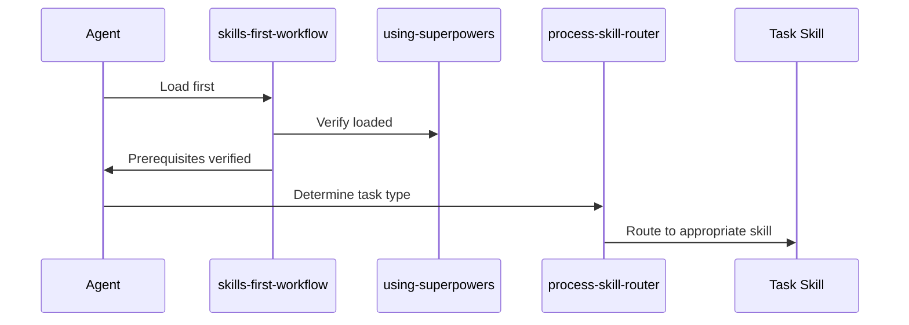
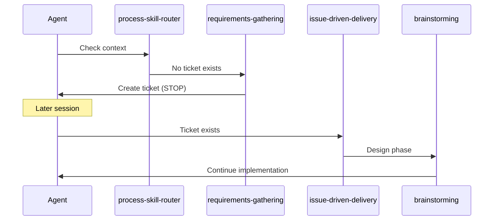
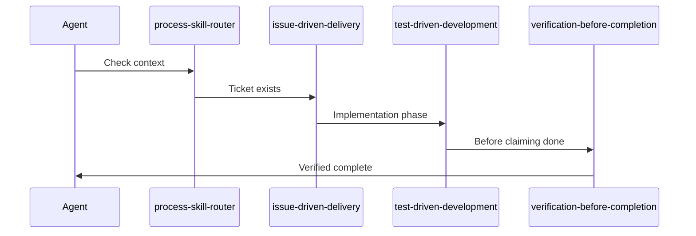

# Skill Dependency Matrix

This document maps relationships between skills in the development-skills repository,
including dependencies on external Superpowers skills.

## Skill Relationship Diagram

```mermaid
flowchart TB
    subgraph External["Superpowers (External)"]
        SP_US[using-superpowers]
        SP_BR[brainstorming]
        SP_WP[writing-plans]
        SP_TDD[test-driven-development]
        SP_VBC[verification-before-completion]
        SP_SD[systematic-debugging]
        SP_RCR[receiving-code-review]
        SP_GW[using-git-worktrees]
        SP_DPA[dispatching-parallel-agents]
        SP_FDB[finishing-a-development-branch]
    end

    subgraph Process["Process Skills"]
        SFW[skills-first-workflow]
        PSR[process-skill-router]
        RG[requirements-gathering]
        IDD[issue-driven-delivery]
        PP[pair-programming]
    end

    subgraph Foundation["Foundation Skills"]
        ASE[automated-standards-enforcement]
        GB[greenfield-baseline]
        RBPB[repo-best-practices-bootstrap]
        BW[broken-window]
        AO[agents-onboarding]
    end

    subgraph Architecture["Architecture Skills"]
        AT[architecture-testing]
        CBC[component-boundary-ownership]
        CCV[contract-consistency-validation]
        SC[scoped-colocation]
    end

    subgraph Quality["Quality Skills"]
        MA[markdown-author]
        SAS[static-analysis-security]
        QGE[quality-gate-enforcement]
        CIC[ci-cd-conformance]
    end

    subgraph Delivery["Delivery Skills"]
        AWA[agent-workitem-automation]
        WSD[walking-skeleton-delivery]
        TDP[technical-debt-prioritisation]
        FDB[finishing-a-development-branch]
    end

    subgraph DotNet[".NET Skills"]
        AIT[aspire-integration-testing]
        TIT[testcontainers-integration-tests]
    end

    %% Core process flow
    SFW --> SP_US
    SFW --> SP_BR
    SFW --> SP_WP
    SFW --> SP_TDD
    SFW --> SP_VBC

    PSR --> RG
    PSR --> SP_BR
    PSR --> SP_WP
    PSR --> SP_TDD
    PSR --> SP_VBC

    RG --> IDD
    IDD --> SP_BR
    IDD --> SP_WP
    IDD --> SP_TDD
    IDD --> SP_RCR
    IDD --> SP_FDB

    %% Foundation dependencies
    ASE --> SP_VBC
    ASE --> SP_TDD
    GB --> SP_VBC
    GB --> SP_TDD
    GB --> IDD
    RBPB --> SP_VBC
    BW --> SP_VBC
    BW --> SP_SD
    BW --> SFW
    AO --> SP_BR
    AO --> SP_VBC

    %% Architecture dependencies
    AT --> SP_TDD
    AT --> SP_VBC
    CBC --> SP_BR
    CBC --> SP_VBC
    CCV --> SP_TDD
    CCV --> SP_VBC
    SC --> SP_VBC

    %% Quality dependencies
    SAS --> SP_VBC
    QGE --> SP_VBC
    QGE --> SP_TDD
    CIC --> SP_VBC
    CIC --> SP_BR

    %% Delivery dependencies
    AWA --> SP_BR
    AWA --> SP_TDD
    AWA --> SP_VBC
    AWA --> IDD
    WSD --> SP_TDD
    WSD --> SP_VBC
    TDP --> SP_VBC
    FDB --> IDD

    %% .NET dependencies
    AIT --> SP_TDD
    AIT --> SP_VBC
    TIT --> SP_TDD
    TIT --> SP_VBC

    %% Pair programming
    PP --> SP_GW
    PP --> SP_DPA
```

## Dependency Matrix

### External Dependencies (Superpowers)

| development-skills Skill           | Required Superpowers Skills                                                                                                        |
| ---------------------------------- | ---------------------------------------------------------------------------------------------------------------------------------- |
| skills-first-workflow              | using-superpowers, brainstorming, writing-plans, test-driven-development, verification-before-completion                           |
| process-skill-router               | brainstorming, writing-plans, test-driven-development, verification-before-completion, systematic-debugging, receiving-code-review |
| issue-driven-delivery              | brainstorming, writing-plans, test-driven-development, receiving-code-review, finishing-a-development-branch                       |
| agent-workitem-automation          | brainstorming, test-driven-development, verification-before-completion                                                             |
| agents-onboarding                  | brainstorming, verification-before-completion                                                                                      |
| best-practice-introduction         | brainstorming, verification-before-completion                                                                                      |
| architecture-testing               | test-driven-development, verification-before-completion                                                                            |
| aspire-integration-testing         | test-driven-development, verification-before-completion                                                                            |
| automated-standards-enforcement    | test-driven-development, verification-before-completion                                                                            |
| broken-window                      | verification-before-completion, systematic-debugging                                                                               |
| branching-strategy-and-conventions | verification-before-completion                                                                                                     |
| change-risk-rollback               | verification-before-completion, systematic-debugging                                                                               |
| ci-cd-conformance                  | brainstorming, verification-before-completion                                                                                      |
| component-boundary-ownership       | brainstorming, verification-before-completion                                                                                      |
| contract-consistency-validation    | test-driven-development, verification-before-completion                                                                            |
| deployment-provenance              | verification-before-completion                                                                                                     |
| documentation-as-code              | verification-before-completion                                                                                                     |
| greenfield-baseline                | test-driven-development, verification-before-completion                                                                            |
| impacted-scope-enforcement         | verification-before-completion                                                                                                     |
| incremental-change-impact          | verification-before-completion                                                                                                     |
| library-extraction-stabilisation   | brainstorming                                                                                                                      |
| local-dev-experience               | verification-before-completion                                                                                                     |
| monorepo-orchestration-setup       | verification-before-completion                                                                                                     |
| pair-programming                   | using-git-worktrees, dispatching-parallel-agents                                                                                   |
| persona-switching                  | verification-before-completion                                                                                                     |
| quality-gate-enforcement           | test-driven-development, verification-before-completion                                                                            |
| release-tagging-plan               | verification-before-completion                                                                                                     |
| repo-best-practices-bootstrap      | verification-before-completion                                                                                                     |
| safe-brownfield-refactor           | test-driven-development, verification-before-completion                                                                            |
| scoped-colocation                  | verification-before-completion                                                                                                     |
| static-analysis-security           | verification-before-completion                                                                                                     |
| technical-debt-prioritisation      | verification-before-completion                                                                                                     |
| testcontainers-integration-tests   | test-driven-development, verification-before-completion                                                                            |
| walking-skeleton-delivery          | test-driven-development, verification-before-completion                                                                            |

### Internal Dependencies (development-skills)

| Skill                          | Depends On             | Depended By                                                                                            |
| ------------------------------ | ---------------------- | ------------------------------------------------------------------------------------------------------ |
| skills-first-workflow          | -                      | broken-window                                                                                          |
| process-skill-router           | requirements-gathering | -                                                                                                      |
| requirements-gathering         | issue-driven-delivery  | process-skill-router                                                                                   |
| issue-driven-delivery          | -                      | requirements-gathering, agent-workitem-automation, greenfield-baseline, finishing-a-development-branch |
| agent-workitem-automation      | issue-driven-delivery  | -                                                                                                      |
| greenfield-baseline            | issue-driven-delivery  | -                                                                                                      |
| finishing-a-development-branch | issue-driven-delivery  | -                                                                                                      |
| broken-window                  | skills-first-workflow  | -                                                                                                      |

## Invocation Order

### Session Start

### New Work (No Ticket)

### Existing Work (Ticket Exists)

## Skill Categories

### Entry Points

Skills that should be loaded first:

1. **skills-first-workflow** - Session initialization
2. **process-skill-router** - Task routing

### Process Skills

Skills that guide workflow methodology:

- requirements-gathering
- issue-driven-delivery
- pair-programming
- agent-workitem-automation

### Foundation Skills

Skills for repository setup:

- greenfield-baseline
- repo-best-practices-bootstrap
- automated-standards-enforcement
- agents-onboarding

### Guard Skills

Skills that prevent anti-patterns:

- broken-window
- quality-gate-enforcement
- impacted-scope-enforcement

## Incompatibility Notes

### Mutual Exclusion

| Skill A                | Skill B                  | Reason                                                              |
| ---------------------- | ------------------------ | ------------------------------------------------------------------- |
| requirements-gathering | brainstorming            | RG creates tickets only; brainstorming designs for existing tickets |
| greenfield-baseline    | safe-brownfield-refactor | Greenfield for new projects; brownfield for existing                |

### Conditional Application

| Primary Skill             | Secondary Skill        | Condition                          |
| ------------------------- | ---------------------- | ---------------------------------- |
| issue-driven-delivery     | requirements-gathering | Use RG first if no ticket exists   |
| architecture-testing      | greenfield-baseline    | AT included in GB for new projects |
| walking-skeleton-delivery | architecture-testing   | WSD may invoke AT for structure    |

## Skill Loading Best Practices

### Always Load

These skills should be loaded at the start of every session:

1. `skills-first-workflow` - Enforces prerequisite verification
2. `process-skill-router` - Routes to correct skill based on context

### Load on Demand

These skills should be loaded when their trigger conditions match:

- Implementation skills (architecture, testing, etc.)
- Platform-specific skills (.NET, etc.)
- Delivery skills (walking-skeleton, etc.)

### Background Skills

These skills provide background guidance but don't require explicit loading:

- `broken-window` - Activated by warnings/errors
- `impacted-scope-enforcement` - Activated during reviews
