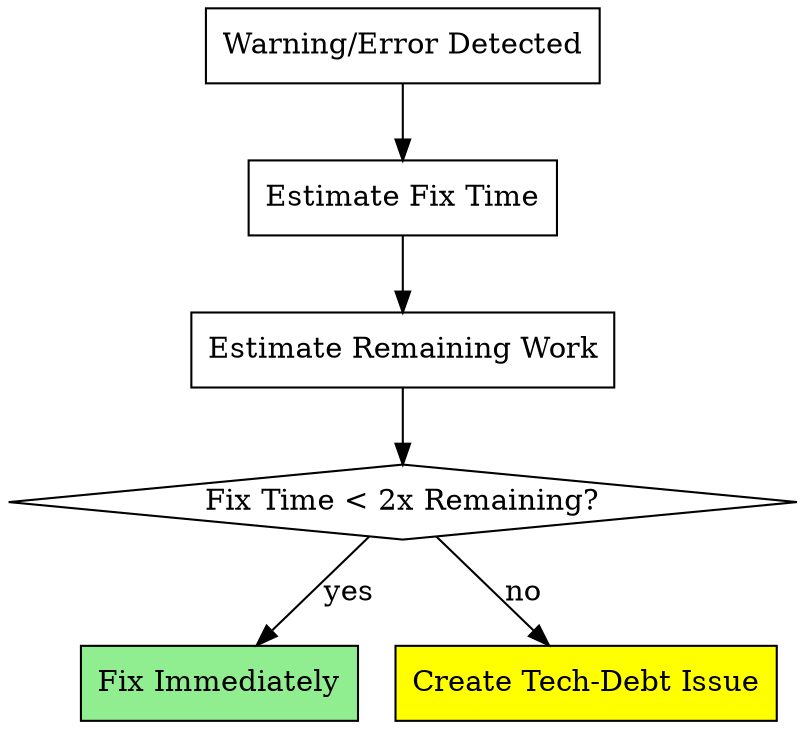

# Broken Window

## Overview

**Fix warnings, errors, and standards violations immediately.** Broken windows—small signs of
neglect—compound into technical debt. The 2x rule: fix now unless fix time > 2x remaining work.

**Violating the letter of these rules IS violating the spirit of these rules.** The 2x threshold is
objective and measurable—there is no "spirit vs letter" escape.

**REQUIRED BACKGROUND:** superpowers:verification-before-completion, superpowers:systematic-debugging

## When to Use

**Always triggered for:**

- Warnings/errors during git, npm, build, or test operations
- Before declaring work complete
- Standards violations detected during code review
- Skills-first repos: Before starting work (validate prerequisites)

## The 2x Rule



**Example:** Remaining work = 15 minutes. Fix takes 10 minutes. Ratio = 0.67x. **Fix immediately.**

## Required Actions

### When Warning/Error Appears

1. Investigate root cause
2. Estimate fix time vs remaining work
3. If fix time < 2x → Fix immediately
4. If fix time ≥ 2x → Create tech-debt issue (label: `tech-debt`, include steps to replicate, fix estimate)
5. Verify warning gone or issue created

### Before Declaring Complete

1. Review against repository standards (README, CONTRIBUTING, docs/)
2. Check for: tests, documentation, code patterns, linting
3. Apply 2x rule to each violation
4. Fix or create tech-debt issue for each violation
5. **Then** declare complete

### Skills-First Repositories

Before starting implementation:

1. Check for `AGENTS.md` with skills-first-workflow
2. Verify superpowers installed and required skills loaded
3. Load missing skills before proceeding

## Red Flags - STOP

- "It's just a warning" / "Normal behaviour" / "Can fix later"
- "No time now" (without 2x calculation)
- "User didn't ask for tests/docs"
- "Scope creep" / "Need to balance"
- "I'll set up linting/verification tools later"
- Working in repo with package.json but no node_modules

**All mean: Apply 2x rule. Fix or create tech-debt issue. No ignoring.**

See `references/rationalizations.md` for complete excuse table and brownfield strategies.

## Quick-Fix Scripts

Common broken window scenarios with immediate fixes:

| Scenario             | Fix Command                          | Description                  |
| -------------------- | ------------------------------------ | ---------------------------- |
| Format violations    | `npm run lint:fix` / `dotnet format` | Auto-fix formatting issues   |
| Spelling errors      | Update `cspell.json` words list      | Add valid technical terms    |
| Missing dependencies | `npm ci` / `dotnet restore`          | Restore package dependencies |
| Outdated lockfile    | `npm install`                        | Regenerate package-lock.json |

### Quick-Fix Script Template

For projects with multiple fix commands, create `scripts/fix-all.sh`:

```bash
#!/usr/bin/env bash
# fix-all.sh - Fix common broken window issues
set -euo pipefail

echo "=== Restoring dependencies ==="
npm ci 2>/dev/null || dotnet restore 2>/dev/null || echo "No package manager detected"

echo "=== Fixing formatting ==="
npm run lint:fix 2>/dev/null || dotnet format 2>/dev/null || echo "No formatter configured"

echo "=== Done ==="
echo "Run 'npm run lint' or equivalent to verify all issues resolved"
```

Use this script to quickly address multiple broken windows before commits.
