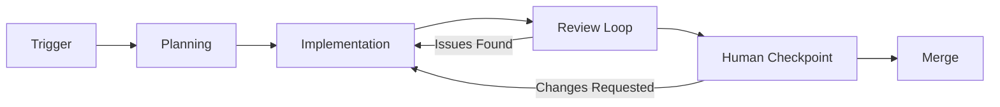

# Pair Programming

## Overview

Pair programming with an AI agent inverts the traditional model: the agent drives
implementation while the human supervises. This enables high throughput on routine
work while preserving human oversight for important decisions.

**Key principles:**

- Agent has high autonomy between human checkpoints
- Automated reviews catch issues before human review
- Human intervenes only when needed
- Work follows issue-driven-delivery throughout

## When to Use

Use this skill when:

- Implementing features from a well-defined backlog
- Processing multiple issues in priority order
- Human wants to supervise rather than actively code
- Work can proceed with periodic checkpoints rather than constant collaboration

Do not use when:

- Exploratory work requiring constant human input
- High-stakes decisions needing real-time human judgement
- Learning/teaching scenarios where collaboration is the goal

## Core Workflow

1. Trigger: Acknowledge receipt, validate Definition of Ready, request clarification if needed
2. Planning: Create implementation plan, identify sub-tasks and dependencies, post summary to issue
3. Implementation: Dispatch sub-agents by skill domain, work in isolated worktrees, coordinate via issue comments
4. Review Loop: Run tests, request persona-based reviews (Tech Lead, QA, Security), iterate until all pass
5. Human Checkpoint: Create PR with comprehensive description, wait for human review
6. Merge: Squash merge on approval, close issue with evidence, archive plan, proceed to next issue

## Workflow Phases

```text
TRIGGER → PLANNING → IMPLEMENTATION → REVIEW LOOP → HUMAN CHECKPOINT → MERGE
```



### Phase 1: Trigger

Work begins through one of three mechanisms:

1. **Issue assignment** - `@agent` mention or direct assignment to agent
2. **Manual command** - `/pair` slash command in conversation
3. **Scheduled batch** - Processing backlog items on schedule

On trigger:

1. Acknowledge receipt in issue comment
2. Validate issue meets Definition of Ready (DoR)
3. If DoR fails, request clarification and wait
4. If DoR passes, proceed to Planning

### Phase 2: Planning

Create implementation plan following `issue-driven-delivery`:

1. Read and understand issue requirements
2. Create plan document in `docs/plans/`
3. Identify sub-tasks and dependencies
4. Determine which sub-agents needed (by skill domain)
5. Post plan summary to issue comment
6. Proceed to Implementation (no human approval needed for standard work)

**Escalate to human if:**

- Requirements are ambiguous
- Architectural decisions needed
- Risk assessment unclear

### Phase 3: Implementation

Execute plan using sub-agents and worktrees:

1. Dispatch sub-agents by skill domain (Backend, Frontend, QA, etc.)
2. Each sub-agent works in isolated git worktree
3. Use appropriate persona for commits
4. Coordinate via issue comments
5. Handle blocked states by switching to parallel tasks

**Progress updates:**

- Post status comment at start of each major task
- Update on blockers immediately
- Summary comment when implementation complete

### Phase 4: Review Loop

Before requesting human review, self-review using personas:

1. Run all tests - must pass
2. Request Tech Lead review (architecture, patterns)
3. Request QA review (test coverage, edge cases)
4. Request Security review (if security-relevant changes)
5. Address feedback from each review
6. Iterate until all automated reviews pass

**Only proceed to Human Checkpoint when:**

- All tests green
- All automated persona reviews pass
- No unresolved critical issues

### Phase 5: Human Checkpoint

Request human review via PR:

1. Create PR with comprehensive description
2. Link to issue and plan
3. Summarize what was done and why
4. Note any decisions made during implementation
5. Wait for human review

**Human options:**

- Approve and merge
- Request changes (agent addresses and re-reviews)
- Take over (agent hands off gracefully)

### Phase 6: Merge

On human approval:

1. Squash merge PR
2. Close linked issue with evidence
3. Delete feature branch
4. Archive plan document
5. Run retrospective prompt (per issue-driven-delivery)
6. Proceed to next issue in backlog

## Skill Integrations

### issue-driven-delivery

Core workflow process - all work follows this skill's steps:

- Issue creation and grooming (steps 1-4)
- Planning and refinement (steps 5-7)
- Implementation (steps 8-12)
- Review and closure (steps 13-20)

Reference: `skills/issue-driven-delivery/SKILL.md`

### persona-switching

Identity management for commits and reviews:

- Development work uses developer account
- Reviews use management personas (Tech Lead, QA)
- Commits attributed to working persona

Reference: `skills/persona-switching/SKILL.md`

### superpowers:using-git-worktrees

Parallel development isolation:

- Each sub-agent task gets isolated worktree
- Prevents file conflicts
- Enables true parallel execution

Reference: Superpowers plugin skill

### superpowers:dispatching-parallel-agents

Sub-agent coordination:

- Dispatch by skill domain or workflow phase
- Parallel execution for independent tasks
- Result aggregation and coordination

Reference: Superpowers plugin skill

## Sub-Agent Orchestration

How the pairing agent dispatches, tracks, and aggregates work across sub-agents, including status-update and aggregation report formats.

See [Sub-Agent Orchestration](references/sub-agent-orchestration.md).

## Git Worktree Isolation

Isolating each agent's work in a dedicated git worktree.

See [Git Worktree Isolation](references/git-worktree-isolation.md).

## Persona Integration

Applying role-based personas within a pairing session.

See [Persona Integration](references/persona-integration.md).

## Human Supervisor Model

The supervision model defining how the human oversees the pairing.

See [Human Supervisor Model](references/human-supervisor-model.md).

## Blocked State Handling

Detecting, recording, and escalating blocked states during pairing.

See [Blocked State Handling](references/blocked-state-handling.md).

## Automated Review Loop

The automated review/fix loop and its status reporting.

See [Automated Review Loop](references/automated-review-loop.md).

## Human Supervisor Interface

Commands and interaction points for the human supervisor.

See [Human Supervisor Interface](references/human-supervisor-interface.md).

## Detection and Deference

### Detection

Before starting pair programming workflow, check for existing setup:

```bash
# Check for existing pair programming configuration
test -f docs/playbooks/pair-programming.md && echo "Playbook exists"

# Check for existing workflow conventions
test -f docs/ways-of-working/pair-programming.md && echo "Conventions exist"

# Check for active pair programming session
gh issue list --label "pair-programming:active" --state open
```

### Deference

If existing pair programming setup found:

- **Playbook exists**: Follow existing playbook, don't recreate
- **Conventions documented**: Respect documented preferences
- **Active session**: Check status before starting new work

Only create new artifacts if none exist.

## Trigger Mechanisms

How pairing detects when to activate, defer, or hand off.

See [Trigger Mechanisms](references/trigger-mechanisms.md).

## Quick Reference

### Starting a Session

```bash
# Trigger via issue assignment
gh issue edit N --add-assignee @agent

# Or via command
/pair #N

# Or batch mode
/pair --backlog --priority p1,p2
```

### Checking Status

```bash
# View active pair programming issues
gh issue list --label "pair-programming:active"

# View agent's current task
gh issue list --assignee @agent --state open --limit 1
```

### Intervention

```bash
# Request agent pause
gh issue comment N --body "@agent please pause for discussion"

# Take over from agent
gh issue comment N --body "@agent I'm taking over this task"

# Resume agent work
gh issue comment N --body "@agent please continue"
```

## Minimal Pairing Mode

For simple tasks or time-constrained sessions, use this streamlined workflow:

### When to Use Minimal Mode

- Task is well-defined with clear acceptance criteria
- Low risk (documentation, config changes, simple features)
- Human has limited availability for checkpoints
- Agent has high confidence in approach

### Minimal Mode Workflow

```text
1. Agent reads issue, posts brief plan (1-3 bullets)
2. Agent implements without waiting for approval
3. Agent creates PR with evidence
4. Human reviews when available
5. Merge or iterate
```

### Minimal Mode Commands

```bash
# Start minimal mode
/pair #N --minimal

# Agent proceeds autonomously
# Posts to issue on completion:
# "Implementation complete. PR #X ready for review."
```

### Minimal Mode Boundaries

- Maximum 4 hours autonomous work
- Must post status update every 2 hours
- Escalate to full mode if:
  - Unexpected complexity discovered
  - Scope change needed
  - Blocking dependency found

## Handoff Record Template

Template for recording a pairing-session handoff.

See [Handoff Record Template](templates/handoff-record.md).

## Red Flags - STOP

These statements indicate pair programming anti-patterns:

| Thought                                       | Reality                                                              |
| --------------------------------------------- | -------------------------------------------------------------------- |
| "Let me just push this quickly"               | All work must be issue-linked and reviewed; no shortcuts             |
| "Skip automated reviews, human will catch it" | Automated reviews catch issues cheaply; always run them first        |
| "Parallel work is too complex"                | Worktrees enable true parallel execution; invest in setup            |
| "Human needs to approve every step"           | That's collaboration, not supervision; define clear checkpoints      |
| "I'll escalate after I try everything"        | Escalate early when blocked; don't waste time on dead ends           |
| "Agent should handle everything autonomously" | Human oversight ensures alignment; balance autonomy with checkpoints |

## See Also

- `docs/references/subagent-coordination-patterns.md` - Patterns for parallel subagent work
- `skills/persona-switching/SKILL.md` - Two-account workflow for PR reviews
- `skills/issue-driven-delivery/SKILL.md` - Issue workflow integration
