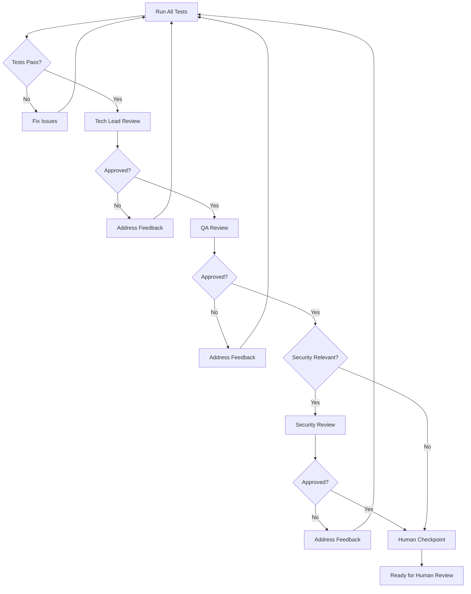

# Automated Review Loop

> Reference material for the [`pair-programming`](../SKILL.md) skill.


Before requesting human review, the agent runs automated self-review using
persona-based reviewers. This section documents the review loop process.

### Review Loop Steps

```text
TESTS → TECH LEAD → QA → SECURITY (if needed) → ITERATE → HUMAN CHECKPOINT
```



#### Step 1: Run All Tests

```bash
# Run full test suite
npm test

# Check coverage meets threshold
npm run test:coverage -- --coverageThreshold='{"global":{"lines":80}}'

# Run linting
npm run lint
```

**Gate:** All tests must pass before proceeding to reviews.

#### Step 2: Tech Lead Review

Switch to Tech Lead persona and review for:

- Architecture alignment with project patterns
- Code organization and structure
- Naming conventions
- Performance implications
- Technical debt introduction

```bash
# Switch persona for review
source ~/.claude/persona-config.sh
use_persona teamlead
```

**Review checklist:**

- [ ] Follows established patterns
- [ ] No unnecessary complexity
- [ ] Appropriate abstraction level
- [ ] Error handling complete
- [ ] Logging adequate

#### Step 3: QA Review

Switch to QA persona and review for:

- Test coverage completeness
- Edge case handling
- Error scenarios tested
- Integration test coverage
- Acceptance criteria verified

```bash
use_persona qa
```

**Review checklist:**

- [ ] All acceptance criteria have tests
- [ ] Edge cases identified and tested
- [ ] Error paths tested
- [ ] No flaky tests introduced
- [ ] Test naming clear and descriptive

#### Step 4: Security Review (Conditional)

Invoke Security review when changes include:

- Authentication/authorization
- User input handling
- External API calls
- Data storage/retrieval
- Cryptographic operations

```bash
use_persona security
```

**Review checklist:**

- [ ] Input validation complete
- [ ] No injection vulnerabilities
- [ ] Secrets not exposed
- [ ] OWASP top 10 considered
- [ ] Audit logging adequate

### Review Personas and Triggers

| Persona     | Trigger                   | Focus                    |
| ----------- | ------------------------- | ------------------------ |
| Tech Lead   | Always                    | Architecture, patterns   |
| QA Engineer | Always                    | Test coverage, quality   |
| Security    | Security-relevant changes | Vulnerabilities, secrets |
| Docs        | Public API changes        | Documentation accuracy   |
| DevOps      | Infrastructure changes    | Deployment, monitoring   |

### Feedback Iteration

When review identifies issues:

1. **Categorise severity**
   - Critical: Must fix before proceeding
   - Important: Should fix, may proceed with plan
   - Minor: Fix if time permits

2. **Auto-fix where possible**
   - Formatting issues: Run prettier
   - Simple type errors: Apply obvious fix
   - Missing tests: Generate test stubs

3. **Escalate when uncertain**
   - Architectural concerns to human
   - Security issues to human
   - Trade-off decisions to human

4. **Re-run affected reviews**
   - Only re-run reviews impacted by changes
   - Track iteration count (max 3 before escalation)

### Human Checkpoint Criteria

Only proceed to human review when ALL conditions met:

- [ ] All automated tests passing
- [ ] Tech Lead review passed
- [ ] QA review passed
- [ ] Security review passed (if applicable)
- [ ] No unresolved critical issues
- [ ] Iteration count < 3 (or human approved continuation)

**If criteria not met:**

```markdown
## Review Loop Status

Unable to proceed to human checkpoint.

**Blocking issues:**

- [ ] QA review: 2 edge cases not tested
- [ ] Security review: Input validation incomplete

**Action needed:**

Fixing identified issues and re-running review loop.
```
