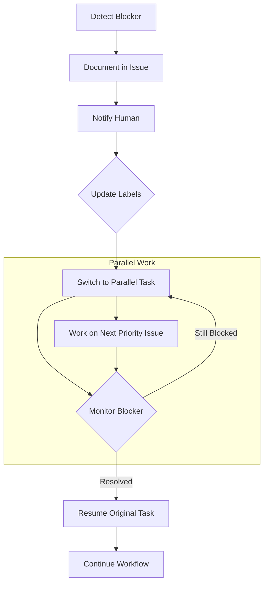

# Blocked State Handling

> Reference material for the [`pair-programming`](../SKILL.md) skill.


When the agent encounters a blocker, it switches to parallel work rather than
waiting idle. This section documents blocked detection, response, and resumption.

### Blocked Detection Triggers

| Trigger                   | Example                  | Auto-Detect |
| ------------------------- | ------------------------ | ----------- |
| External dependency       | Waiting for API access   | No          |
| Human input required      | Ambiguous requirement    | Yes         |
| Review pending            | Waiting for PR approval  | Yes         |
| Resource unavailable      | CI runner queue full     | Yes         |
| Technical blocker         | Test environment down    | No          |
| Upstream issue unresolved | Depends on blocked issue | Yes         |

**Auto-detection:** Agent recognises these blockers automatically
**Manual detection:** Agent flags when explicitly identified

### Blocked Response Protocol

When blocked, the agent follows this protocol:

```text
DETECT → DOCUMENT → NOTIFY → SWITCH → MONITOR → RESUME
```



#### 1. Document Blocker

Post blocker details to issue:

```markdown
## Blocked

**Issue:** #123
**Blocker:** Waiting for database credentials from ops team
**Blocked since:** 2024-01-15 10:30 UTC
**Impact:** Cannot complete integration tests

### What's needed

- Database connection string for staging environment
- Read-only credentials acceptable

### Parallel work

Switching to #124 (frontend validation) while blocked.
```

#### 2. Update Status

```bash
# Add blocked label
gh issue edit 123 --add-label "pair-programming:blocked"

# Remove active label
gh issue edit 123 --remove-label "pair-programming:active"
```

#### 3. Notify Human

Per notification preferences:

- Post blocker comment (always)
- Direct notification if `notify:blocked` configured
- Auto-escalate after timeout (default: 4 hours)

#### 4. Switch to Parallel Work

Select next task from backlog:

```bash
# Find next ready issue by priority
gh issue list \
  --label "ready" \
  --state open \
  --json number,title,labels \
  --jq 'sort_by(.labels | map(select(.name | startswith("priority:"))) | .[0].name) | .[0]'
```

**Selection criteria:**

1. Not blocked
2. Highest priority
3. No dependencies on blocked work
4. Within agent capability

#### 5. Monitor for Unblock

While working on parallel task:

- Periodically check blocker status
- Watch for human comments on blocked issue
- Listen for dependency resolution

### Resumption Protocol

When blocker resolved:

1. **Acknowledge unblock** - Comment on issue

   ```markdown
   Blocker resolved. Resuming work on #123.
   Current parallel work (#124) will be paused.
   ```

2. **Update labels**

   ```bash
   gh issue edit 123 --remove-label "pair-programming:blocked"
   gh issue edit 123 --add-label "pair-programming:active"
   ```

3. **Resume from saved state** - Continue from last known good state

4. **Handle parallel work** - Either complete quickly or pause for later

### Escalation Configuration

| Setting              | Description                   | Default  |
| -------------------- | ----------------------------- | -------- |
| `escalate_after`     | Hours before auto-escalation  | `4`      |
| `escalate_to`        | Who receives escalation       | `@human` |
| `max_blocked_issues` | Max concurrent blocked issues | `3`      |
| `auto_close_stale`   | Close blocked issues after    | `7 days` |

### Integration with issue-driven-delivery

Blocked handling integrates with the `issue-driven-delivery` skill's blocked
workflow:

- Blocked issues tracked in WIP limits
- Escalation follows defined paths
- Retrospective includes blocked time analysis
