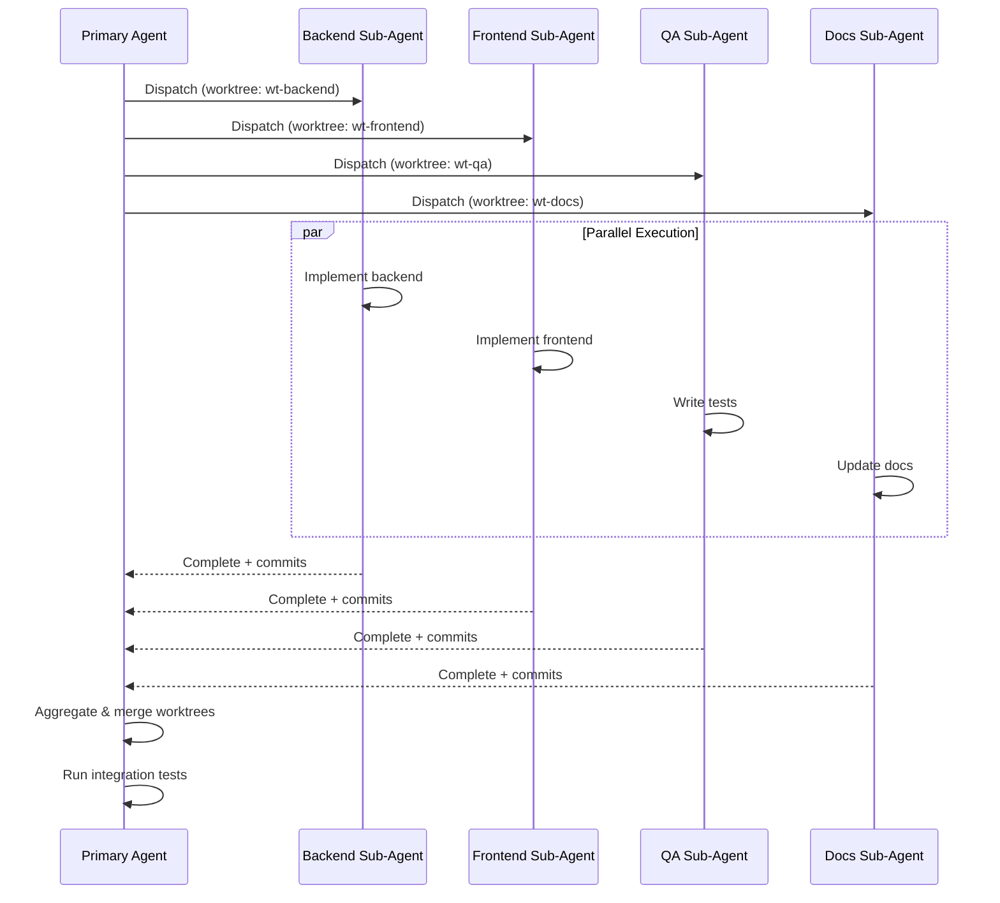

# Sub-Agent Orchestration

> Reference material for the [`pair-programming`](../SKILL.md) skill.


When implementing complex features, the primary agent orchestrates work across
multiple sub-agents. This section documents dispatch strategies, coordination
mechanisms, and result aggregation patterns.

### Dispatch Strategies

Sub-agents can be dispatched using three complementary strategies:

#### By Skill Domain

Dispatch sub-agents based on their specialization:

| Domain   | Sub-Agent Focus                     | Example Tasks                         |
| -------- | ----------------------------------- | ------------------------------------- |
| Backend  | API, database, business logic       | Implement endpoint, write migrations  |
| Frontend | UI components, state management     | Build form, add validation            |
| QA       | Test coverage, edge cases           | Write integration tests, verify flows |
| DevOps   | CI/CD, infrastructure               | Update pipeline, configure deployment |
| Security | Vulnerability assessment, hardening | Review auth flow, scan dependencies   |
| Docs     | Documentation, API specs            | Update README, generate OpenAPI spec  |

**Selection criteria:**

- Match task requirements to sub-agent expertise
- Prefer specialist over generalist for domain-specific work
- Use generalist for cross-cutting concerns

#### By Workflow Phase

Dispatch sub-agents aligned with implementation phases:

```text
PLANNING --> IMPLEMENTATION --> TESTING --> REVIEW --> DOCUMENTATION
```

| Phase          | Sub-Agent Role                              |
| -------------- | ------------------------------------------- |
| Planning       | Analyze requirements, create task breakdown |
| Implementation | Write code following approved plan          |
| Testing        | Create tests, verify acceptance criteria    |
| Review         | Persona-based review (Tech Lead, QA, etc.)  |
| Documentation  | Update docs, add inline comments            |

**Benefits:**

- Clear handoff points between phases
- Each sub-agent operates within defined scope
- Progress easily tracked through phase completion

#### Parallel Execution

Dispatch multiple sub-agents simultaneously for independent tasks:

```text
+------------------+
|  Primary Agent   |
|  (Orchestrator)  |
+--------+---------+
         | dispatch
    +----+----+--------+--------+
    v         v        v        v
+-------+ +-------+ +-------+ +-------+
|Backend| |Frontend| |  QA   | | Docs  |
|Sub-Ag | |Sub-Ag | |Sub-Ag | |Sub-Ag |
+---+---+ +---+---+ +---+---+ +---+---+
    |         |        |        |
    +----+----+--------+--------+
         | aggregate
    +----v----+
    | Results |
    +---------+
```



**Prerequisites for parallel dispatch:**

- Tasks have no shared state dependencies
- Tasks can complete independently
- Clear success criteria for each task
- Isolated worktrees prevent file conflicts

Reference: `superpowers:dispatching-parallel-agents` for detailed parallel
execution patterns.

### Coordination Mechanisms

#### Issue Comments

The primary coordination channel is GitHub issue comments:

```markdown
## Sub-Agent Status Update

**Agent:** Backend Sub-Agent
**Task:** Implement user authentication endpoint
**Status:** In Progress
**Started:** 2024-01-15 10:30 UTC

### Progress

- [x] Database schema created
- [x] Repository layer implemented
- [ ] Controller endpoint (current)
- [ ] Integration tests

### Blockers

None

### Next Update

Expected completion: 2024-01-15 14:00 UTC
```

**Comment conventions:**

- Post status at task start, on blockers, and at completion
- Use consistent formatting for easy parsing
- Tag primary agent on blockers requiring intervention
- Link to relevant commits and PRs

#### Status Tracking

Track sub-agent status using structured labels or status tables:

**Label-based tracking:**

```bash
# Add status label to issue
gh issue edit N --add-label "sub-agent:backend:in-progress"
gh issue edit N --remove-label "sub-agent:backend:in-progress"
gh issue edit N --add-label "sub-agent:backend:complete"
```

**Table-based tracking (in issue body or comment):**

| Sub-Agent | Task              | Status      | Worktree          | Last Update |
| --------- | ----------------- | ----------- | ----------------- | ----------- |
| Backend   | Auth endpoint     | In Progress | `wt-backend-123`  | 10:30 UTC   |
| Frontend  | Login form        | Complete    | `wt-frontend-123` | 11:45 UTC   |
| QA        | Integration tests | Pending     | -                 | -           |
| Docs      | API documentation | Blocked     | `wt-docs-123`     | 12:00 UTC   |

**Status values:**

- `Pending` - Not yet started
- `In Progress` - Actively being worked
- `Blocked` - Waiting on dependency or clarification
- `Complete` - Task finished successfully
- `Failed` - Task could not complete (requires intervention)

### Result Aggregation

After sub-agents complete their tasks, the primary agent aggregates results:

#### Aggregation Checklist

1. **Collect completion status** from all sub-agents
2. **Verify success criteria** met for each task
3. **Merge worktrees** in dependency order
4. **Resolve conflicts** if any arise during merge
5. **Run integration tests** on combined changes
6. **Update issue** with aggregated results

#### Aggregation Report Template

Post aggregation summary to issue:

```markdown
## Sub-Agent Aggregation Report

**Issue:** #123 - Implement user authentication
**Aggregated:** 2024-01-15 15:00 UTC

### Sub-Agent Results

| Sub-Agent | Task              | Result  | Commits          |
| --------- | ----------------- | ------- | ---------------- |
| Backend   | Auth endpoint     | Success | abc1234, def5678 |
| Frontend  | Login form        | Success | 111aaaa, 222bbbb |
| QA        | Integration tests | Success | 333cccc          |
| Docs      | API documentation | Success | 444dddd          |

### Integration Verification

- [x] All worktrees merged successfully
- [x] No merge conflicts
- [x] Integration tests passing
- [x] Build successful

### Combined Artifacts

- PR: #456
- Test coverage: 87% (+5%)
- Documentation: Updated API spec

### Next Steps

Ready for automated review loop (Phase 4)
```

#### Conflict Resolution

When sub-agent work conflicts:

1. **Identify conflict scope** - Which files, which changes
2. **Determine priority** - Use skill priority model (P0 > P1 > P2 > P3)
3. **Resolve in order** - Higher priority sub-agent changes take precedence
4. **Verify resolution** - Run tests after conflict resolution
5. **Document decision** - Record why specific resolution chosen

**Conflict escalation:**

- Minor conflicts: Primary agent resolves
- Architectural conflicts: Escalate to human supervisor
- Security-related conflicts: Always escalate
