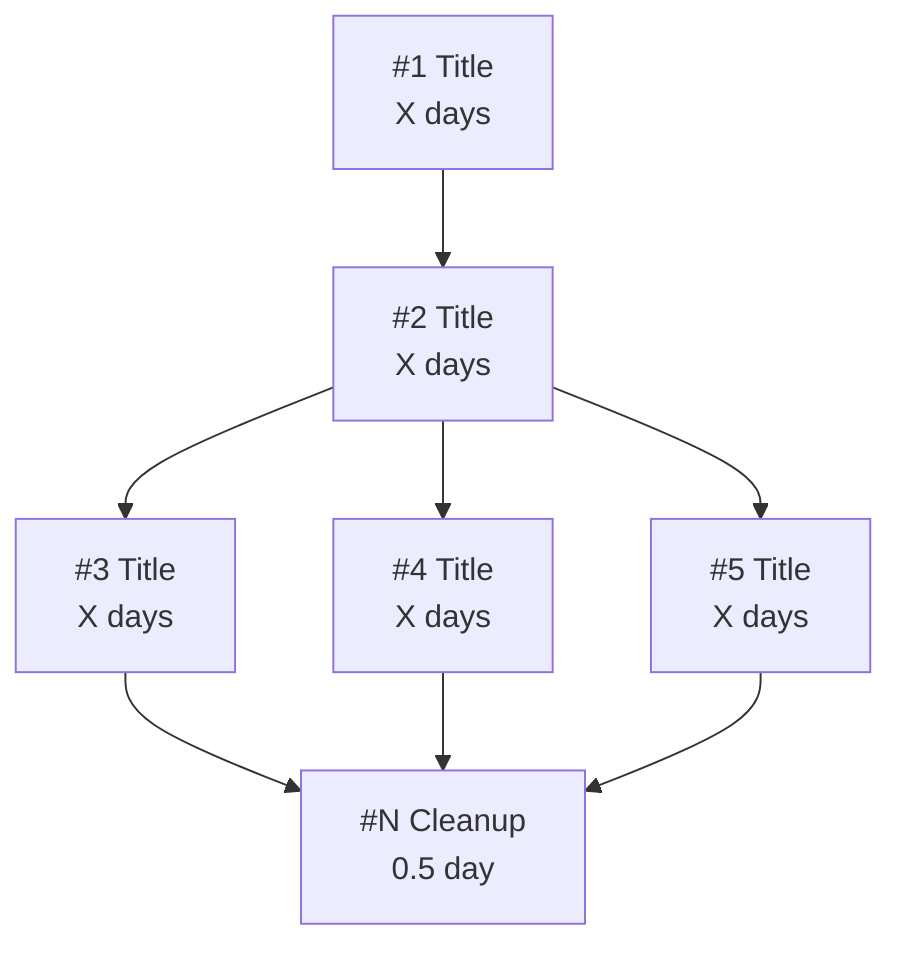

# Decomposition Formats

## Overview

When presenting decomposition proposals, use three complementary views to give users complete
visibility into the proposed ticket structure.

## Outline View

Hierarchical view showing ticket relationships:

```text
Epic: [Epic Title]
├── #1 [Ticket Title] [Category]
│   └── [Brief description]
│   └── blocked by: [dependencies]
├── #2 [Ticket Title] [Category]
│   └── [Brief description]
│   └── blocked by: #1
├── #3 [Ticket Title] [Category]
│   └── [Brief description]
│   └── blocked by: #1, #2
└── #N Remove Feature Flags [Cleanup]
    └── Remove all feature flags, verify flows
    └── blocked by: [all feature tickets]
```

### Category Labels

- `[Foundation]` - Infrastructure, schema, shared components
- `[Feature]` - User-facing functionality
- `[Integration]` - Connecting components together
- `[Cleanup]` - Technical debt, flag removal

## Details Table

Tabular view with full information:

```markdown
| #   | Title                | Description                           | Blocked By | Size   | Safe to Ship           |
| --- | -------------------- | ------------------------------------- | ---------- | ------ | ---------------------- |
| 1   | [Title]              | [What this delivers]                  | —          | X days | Yes/No (reason)        |
| 2   | [Title]              | [What this delivers]                  | #1         | X days | Yes/Flag/No (reason)   |
| ... | ...                  | ...                                   | ...        | ...    | ...                    |
| N   | Remove Feature Flags | Remove flags, verify all flows work   | #X, #Y, #Z | 0.5 day| Yes (final cleanup)    |
```

### Safe to Ship Values

- `Yes` - Can deploy independently without user impact
- `Yes (reason)` - Safe with explanation (e.g., "no consumers yet")
- `Flag until #X` - Needs feature flag until dependency ready
- `No (reason)` - Cannot ship independently

### Size Guidelines

- Foundation/schema: 0.5-1 day
- Simple feature: 1-2 days
- Complex feature: 2-3 days
- Integration: 1-2 days
- Cleanup: 0.5 day

## Dependency Graph (ASCII)

Visual graph for terminal display:

```text
                    ┌─────────────────────┐
                    │  #1 [Title]         │
                    │     [X days]        │
                    └──────────┬──────────┘
                               │
                               ▼
                    ┌─────────────────────┐
                    │  #2 [Title]         │
                    │     [X days]        │
                    └──────────┬──────────┘
                               │
              ┌────────────────┼────────────────┐
              │                │                │
              ▼                ▼                ▼
   ┌──────────────────┐ ┌──────────────────┐ ┌──────────────────┐
   │  #3 [Title]      │ │  #4 [Title]      │ │  #5 [Title]      │
   │     [X days]     │ │     [X days]     │ │     [X days]     │
   └────────┬─────────┘ └────────┬─────────┘ └────────┬─────────┘
            │                    │                    │
            └───────────────┬────┴────────────────────┘
                            ▼
                 ┌─────────────────────┐
                 │  #N Cleanup         │
                 │     [0.5 day]       │
                 └─────────────────────┘

Critical Path: #1 → #2 → #X → #N (Y days)
Parallel Work: #3, #4, #5 can run in parallel after #2
```

## Dependency Graph (Mermaid)

For embedding in epic description (renders in GitHub/Azure DevOps):

````markdown

````

## Feature Flag Table

When decomposition requires feature flags:

```markdown
## Feature Flags

| Flag                    | Introduced In | Purpose                          | Status   |
| ----------------------- | ------------- | -------------------------------- | -------- |
| `FEATURE_X_ENABLED`     | #3            | Hide feature until #4 ready      | Active   |
| `FEATURE_Y_ENABLED`     | #4            | Gradual rollout                  | Active   |

**Cleanup ticket:** #N
```

## User Editing Instructions

After presenting proposal, offer editing:

```text
You can now:
- Merge tickets (e.g., "combine #3 and #4")
- Split tickets (e.g., "split #2 into two")
- Reorder dependencies (e.g., "make #5 depend on #1 only")
- Modify titles or descriptions
- Add or remove tickets

What changes would you like to make, or does this look good?
```

## Final Review Template

Before creating tickets, show final review:

```text
Final Review - Please Confirm

[Show complete outline view]
[Show complete details table]
[Show complete dependency graph]

This will create:
- 1 epic ticket
- N child tickets
- Dependencies linked via [platform method]
- Feature flags tracked in epic and cleanup ticket

Type "confirm" to create these tickets, or request changes.
```
