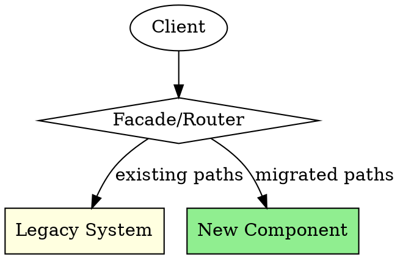

# Safe Brownfield Refactor

## Overview

**Refactor legacy code safely through incremental, reversible changes.** Brownfield systems require
different strategies than greenfield development. This skill provides guardrails for modernising
code without destabilising production systems.

**REQUIRED BACKGROUND:** superpowers:test-driven-development, superpowers:verification-before-completion

## When to Use

**Triggered when:**

- Modifying legacy code without comprehensive test coverage
- Introducing changes to long-running production systems
- Modernising technology stacks incrementally
- Refactoring code you do not fully understand
- Improving code quality in systems with high change risk
- Working with code that has implicit dependencies or undocumented behaviour

## Core Principles

### 1. Characterisation Tests First

Before changing any code, write tests that capture current behaviour:

```text
1. Identify the code unit to change
2. Write tests that document existing behaviour (even if "wrong")
3. Verify tests pass against current implementation
4. Only then begin refactoring
```

**Characterisation tests are not unit tests.** They document what code does, not what it should do.
They become your safety net during refactoring.

### 2. Strangler Fig Pattern

Incrementally replace legacy code without big-bang rewrites:



**Implementation steps:**

1. Create a facade or routing layer in front of legacy code
2. Implement new functionality behind the facade
3. Gradually route traffic from legacy to new implementation
4. Remove legacy code only after new code is proven

### 3. Seam-Based Extraction

Find natural seams in code to enable testing and replacement:

| Seam Type          | Description                                   | Example                        |
| ------------------ | --------------------------------------------- | ------------------------------ |
| Object seam        | Replace behaviour via inheritance/composition | Extract interface, inject mock |
| Preprocessing seam | Conditional compilation                       | Feature flags                  |
| Link seam          | Replace dependencies at build/deploy time     | Dependency injection           |

**Finding seams:**

- Look for constructor parameters, method arguments
- Identify static calls that could be instance calls
- Find configuration points that affect behaviour

### 4. Small, Reversible Changes

Every change should be:

- **Incremental**: One logical change at a time
- **Reversible**: Easy to revert if problems arise
- **Deployable**: Each commit could go to production
- **Observable**: Behaviour difference is measurable

```text
Bad:  Rewrite entire module (3000 lines changed)
Good: Extract single method, add test, refactor (50 lines changed)
```

## Risk Assessment Matrix

Before each refactoring task, assess risk:

| Factor               | Low Risk        | Medium Risk    | High Risk        |
| -------------------- | --------------- | -------------- | ---------------- |
| Test coverage        | >80%            | 40-80%         | <40%             |
| Code understanding   | Well documented | Some docs      | No docs          |
| Deployment frequency | Daily           | Weekly         | Monthly+         |
| Rollback capability  | Automated       | Manual (fast)  | Manual (slow)    |
| Business criticality | Low traffic     | Medium traffic | Revenue critical |

**Risk mitigation by level:**

- **Low risk**: Proceed with standard TDD
- **Medium risk**: Add characterisation tests, use feature flags
- **High risk**: Parallel implementation, gradual cutover, comprehensive monitoring

## Workflow

### Phase 1: Understanding

1. **Map dependencies** - Document what the code touches
2. **Identify risks** - Use risk assessment matrix
3. **Find seams** - Locate points for safe modification
4. **Document behaviour** - Write characterisation tests

### Phase 2: Preparation

1. **Add monitoring** - Ensure you can detect regressions
2. **Create rollback plan** - Know how to revert quickly
3. **Set up feature flags** - Enable gradual rollout if needed
4. **Establish baseline** - Record current performance/behaviour metrics

### Phase 3: Execution

1. **One change at a time** - Atomic, focused commits
2. **Test after each change** - Run characterisation tests
3. **Deploy frequently** - Validate in production early
4. **Monitor closely** - Watch for unexpected behaviour

### Phase 4: Verification

1. **Compare metrics** - Before/after performance
2. **Validate behaviour** - Characterisation tests still pass
3. **Remove scaffolding** - Delete old code paths when safe
4. **Update documentation** - Reflect new architecture

## Anti-Patterns to Avoid

### Big Bang Rewrites

**Problem:** "Let's rewrite the whole thing properly"
**Reality:** Rewrites fail more often than they succeed

**Instead:** Incremental strangler fig, one component at a time

### Testing After Refactoring

**Problem:** "I'll add tests after I clean up the code"
**Reality:** Changes without tests are changes without a safety net

**Instead:** Characterisation tests BEFORE any changes

### Optimistic Timelines

**Problem:** "It's just a small refactor, should take a day"
**Reality:** Legacy code contains hidden complexity

**Instead:** Triple your estimate, plan for unexpected dependencies

### Ignoring Production Feedback

**Problem:** "Tests pass, so it's fine"
**Reality:** Production has scenarios tests do not cover

**Instead:** Deploy incrementally, monitor metrics, be ready to rollback

## Emergency Rollback Checklist

If production issues occur during refactoring:

1. [ ] Revert feature flag (if applicable)
2. [ ] Rollback deployment to last known good state
3. [ ] Verify system stability
4. [ ] Capture reproduction steps and logs
5. [ ] Root cause analysis before retry
6. [ ] Add characterisation test for discovered behaviour

## Integration with Other Skills

- **broken-window**: Apply 2x rule when encountering legacy issues
- **technical-debt-prioritisation**: Prioritise refactoring opportunities
- **change-risk-rollback**: Detailed rollback strategies
- **characterisation testing**: Advanced techniques (see references/)

## Quick Reference

| Situation             | Action                             |
| --------------------- | ---------------------------------- |
| No tests exist        | Write characterisation tests first |
| Understanding is poor | Document before changing           |
| Change is large       | Break into smaller increments      |
| Rollback is slow      | Add feature flags                  |
| Risk is high          | Parallel implementation            |
